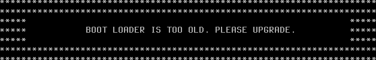

#+TITLE: 系统管理
#+HTML_HEAD: <link rel="stylesheet" type="text/css" href="css/main.css" />
#+HTML_LINK_HOME: freebsd.html
#+HTML_LINK_UP: dtrace.html
#+OPTIONS: num:nil timestamp:nil ^:nil

* 启动引导器及配置文件(loader.conf)
** loader.conf 的功能定位与文件结构
根据 [[https://man.freebsd.org/cgi/man.cgi?query=loader.conf][loader.conf(5)]] 手册页所述，loader.conf 是 FreeBSD 系统引导过程中的核心配置文件。该文件在引导加载程序 loader(8) 阶段被读取，用于指定要 _启动的内核_ 、 _传递给内核的参数_ 以及需要 _加载的附加模块_ ，同时可设置 loader(8) 支持的所有变量

loader.conf(5) 相关的文件结构如下：
#+begin_example
  /
  └── boot/ 操作系统引导过程中使用的程序和配置文件
       ├── loader.conf 用户定义设置
       ├── loader.conf.lua 使用 Lua 编写的用户定义设置（默认不存在）
       ├── loader.conf.d/ 用户定义设置的子目录（默认为空）
       │    ├── *.conf 拆分成多个文件的用户定义设置（默认不存在）
       │    └── *.lua 使用 Lua 编写并拆分成多个文件的用户定义设置（默认不存在）
       ├── loader.conf.local 机器特定设置，可覆盖其他配置文件中的设置（默认不存在）
       └── defaults/ 存放默认引导配置文件
            └── loader.conf 默认设置文件（请勿直接修改），参见 loader.conf(5)
#+end_example

loader.conf 是系统启动配置的关键文件，位于 */boot/loader.conf* 文件。写入此处的配置比 _rc.conf_ 文件更早生效，但不当配置可能会妨碍系统正常启动

#+begin_example
  详细说明请参考 loader.conf 手册页

  不建议直接修改 /boot/defaults/loader.conf 文件

  如需自定义配置，应使用 /boot/loader.conf 文件或 /boot/loader.conf.local 文件进行本地配置扩展

  其中 /boot/loader.conf.local 文件优先级最高，专门用于机器特定设置
#+end_example
** ZFS 标准安装场景下的 loader.conf 配置内容
在 ZFS 标准安装方案中，/boot/loader.conf 文件通常包含以下配置内容（以 15.0-RELEASE 为例）：

#+begin_src sh 
  kern.geom.label.disk_ident.enable="0"     # 禁用 disk_ident 标签，形如 /dev/diskid/DISK-S3Z4NB0K123456（硬件序列号）
  kern.geom.label.gptid.enable="0"     # 禁用基于 GPT UUID 生成的设备名，形如 /dev/gptid/3f6c3a3e-4bcb-11ee-8e6d-001b217e6c8a
  zfs_enable="YES"     # 默认加载 zfs 模块
#+end_src

该文件由 _bsdinstall(8)_ 安装程序在系统安装过程中自动写入。具体而言，[[https://github.com/freebsd/freebsd-src/blob/e6d579be42550f366cc85188b15c6eb0cad27367/usr.sbin/bsdinstall/scripts/zfsboot#L1385][usr.sbin/bsdinstall/scripts/zfsboot]] 脚本会分别写入 _kern.geom.label.disk_ident.enable="0"_ 、 _kern.geom.label.gptid.enable="0"_ 和 _zfs_enable="YES"_ 这三行配置

#+begin_example
因此在使用 ZFS 标准安装方案的系统中，这三行即是 /boot/loader.conf 文件的全部初始内容
#+end_example
** 默认配置文件的内容结构与说明
默认配置文件位于源代码中的 [[https://github.com/freebsd/freebsd-src/blob/main/stand/defaults/loader.conf][stand/defaults/loader.conf]]。以下内容基于版本 [[https://github.com/freebsd/freebsd-src/commit/240c614d48cb0484bfe7876decdf6bbdcc99ba73][loader.conf.5: "console" setting does not document multi-value possiblity]]：

#+begin_src sh 
  # 这是 loader.conf —— 一个包含许多实用变量的文件
  # 可通过设置这些变量来改变系统的默认加载行为。
  # 不应直接编辑此文件！
  # 请把任何要覆盖的设置放入 loader_conf_files 中的某个文件里
  # 这样以后在更新这些默认值时，就不会影响原生配置信息。

  #
  # 所有参数都必须使用双引号。
  #

  ###  基础配置选项  ############################
  # 执行命令，在屏幕上打印“Loading /boot/defaults/loader.conf”这句话
  exec="echo Loading /boot/defaults/loader.conf"     # （正在加载 /boot/defaults/loader.conf）

  # 内核设置
  kernel="kernel"		# /boot 子目录，包含内核和模块。
  bootfile="kernel"	# 内核名称（可以是绝对路径）
  kernel_options=""	# 传递给内核的标志

  # 引导启动器配置文件配置
  loader_conf_files="/boot/device.hints /boot/loader.conf"   # loader 默认读取的配置文件列表
  loader_conf_dirs="/boot/loader.conf.d"                     # loader 读取的配置目录，将加载该目录中的 *.conf 和 *.lua 文件
  local_loader_conf_files="/boot/loader.conf.local"          # 本机专用配置文件，可覆盖其他配置文件中的设置
  nextboot_conf="/boot/nextboot.conf"                        # 下一次启动使用的临时配置文件
  verbose_loading="NO"		# 设置为 YES 将启用详细的引导输出

  ###  启动画面配置  ############################
  # 启动 Logo 设置
  splash_bmp_load="NO"		# 设置为 YES 将启用 bmp 启动画面
  splash_pcx_load="NO"		# 设置为 YES 将启用 pcx 启动画面
  splash_txt_load="NO"		# 设置为 YES 将启用 TheDraw 启动画面
  vesa_load="NO"			# 设置为 YES 将加载 vesa 模块
  bitmap_load="NO"		# 如果想使用启动画面，请设置为 YES
  bitmap_name="splash.bmp"	# 设置为文件名
  bitmap_type="splash_image_data" # 并将其放在 module_path 中
  splash="/boot/images/freebsd-logo-rev.png"  # 再设置 boot_mute=YES 将加载它

  ###  屏幕保护模块  ###################################
  # 最好在 rc.conf 中设置这些屏保
  screensave_load="NO"		# 设置为 YES 将加载屏幕保护程序模块
  screensave_name="green_saver"	# 设置要使用的屏幕保护程序模块名称

  ###  早期 hostid 配置 ############################
  # 这台机器的唯一标识
  hostuuid_load="YES"        # 设置为 YES 来加载 hostuuid 模块
  hostuuid_name="/etc/hostid" # 指定 hostid 文件路径
  hostuuid_type="hostuuid"   # 指定模块类型为 hostuuid

  ###  随机数生成配置  ##################
  # 适用于密码模块，随机数生成
  # 参见 rc.conf(5)。rc.conf 中 entropy_boot_file 配置变量必须与下面的设置相同
  # rc.conf 中的 entropy_boot_file 和 loader.conf 中的 entropy_cache_name 必须指定同一个文件
  entropy_cache_load="YES"		# 设置为 NO 将禁用在启动时加载缓存的熵
  entropy_cache_name="/boot/entropy"	# 设置为该文件的名称
  entropy_cache_type="boot_entropy_cache"	# 内核查找启动时熵缓存所必需的类型。即使上面的 _name 发生变化，这个值也绝不能改变！
  entropy_efi_seed="YES"			# 设置为 NO 将禁用从 UEFI 硬件随机数生成器 API 加载熵
  entropy_efi_seed_size="2048"		# 设置为其他值以改变从 EFI 请求的熵数量

  ###  内存黑名单配置  ############################
  # 屏蔽坏内存地址用，适用于服务器
  ram_blacklist_load="NO"			# 设置为 YES 可加载一个文件，该文件包含需要从运行系统中排除的地址列表
  ram_blacklist_name="/boot/blacklist.txt" # 设置为该文件的名称
  ram_blacklist_type="ram_blacklist"	# 内核查找黑名单模块所必需的类型

  ###  微码加载配置  ########################
  # 处理器微码配置
  cpu_microcode_load="NO"			# 设置为 YES 以在启动时加载并应用微码更新文件
  cpu_microcode_name="/boot/firmware/ucode.bin" # 设置为微码更新文件路径
  cpu_microcode_type="cpu_microcode"	# 内核查找微码更新文件所必需的类型

  ###  ACPI 设置  ##########################################
  acpi_dsdt_load="NO"		# DSDT 覆盖
  acpi_dsdt_type="acpi_dsdt"	# 请勿修改此项
  acpi_dsdt_name="/boot/acpi_dsdt.aml"     # 使用此文件覆盖 BIOS 中的 DSDT
  acpi_video_load="NO"		# ACPI 视频扩展驱动

  ###  审计设置  #########################################
  # 安全审计系统的事件定义预加载配置
  audit_event_load="NO"		# 设置为 YES 将在启动早期预加载 audit_event 配置文件
  audit_event_name="/etc/security/audit_event" # 指定 audit_event 配置文件路径
  audit_event_type="etc_security_audit_event"  # 内核查找并识别该配置文件所需的类型

  ### 初始内存磁盘设置 ###########################
  # 内存盘设置
  #mdroot_load="YES"		# “mdroot” 前缀可任意修改
  #mdroot_type="md_image"		# 在启动时创建 md(4) 内存磁盘
  #mdroot_name="/boot/root.img"	# 指向包含磁盘镜像的文件路径
  #rootdev="ufs:/dev/md0"		# 将根文件系统设置为 md(4) 设备

  ###  引导设置  ########################################
  #loader_delay="3"		# 在加载任何内容前延迟的秒数。默认未设置且禁用（无延迟）
  #autoboot_delay="10"		# 自动启动前延迟的秒数，-1 表示禁止用户中断，NO 表示禁用
  #print_delay="1000000"		# loader 消息的慢速打印，便于调试。单位为微秒（1000000 微秒 = 1 秒）
  #password=""			# 修改启动选项的密码，避免修改启动选项
  #bootlock_password=""		# 设置启动锁定密码，避免未授权启动（参见 check-password.4th(8)）
  #geom_eli_passphrase_prompt="NO" # 是否提示：输入 geli(8) 密码来挂载根文件系统
  bootenv_autolist="YES"		# 自动填充 ZFS 启动环境列表
  #beastie_disable="NO"		# 是否启用 Beastie（小恶魔）启动菜单
  efi_max_resolution="1x1"	# 设置 EFI 引导下使用的最大分辨率：可选 480p、720p、1080p、1440p、2160p/4k、5k；自定义宽 x 高（例如 1920x1080）
  #kernels="kernel kernel.old"	        # 在启动菜单中显示的内核列表
  kernels_autodetect="YES"	        # 自动检测 /boot 中的内核目录
  #loader_gfx="YES"		        # 当图形可用时使用图形界面
  #loader_logo="orbbw"		        # 可选启动 Logo 有：orbbw、orb、fbsdbw、beastiebw、beastie、none
  #comconsole_speed="115200"	        # 设置当前串口控制台速率
  #console="vidconsole"		        # 以逗号（,）或空格（ ）分隔的控制台列表
  #currdev="disk1s1a"		        # 设置当前设备
  module_path="/boot/modules;/boot/firmware;/boot/dtb;/boot/dtb/overlays"  # 设置模块搜索路径
  module_blacklist="drm drm2 radeonkms i915kms amdgpu if_iwlwifi if_rtw88 if_rtw89"  # 引导器模块黑名单
  module_blacklist="${module_blacklist} nvidia nvidia-drm nvidia-modeset"        # 追加黑名单模块
  #prompt="\\${interpret}"		        # 设置 loader 命令提示符
  #root_disk_unit="0"		        # 强制设置根磁盘单元号
  #rootdev="disk1s1a"		        # 设置根文件系统
  #dumpdev="disk1s1b"		        # 在启动早期设置 dump 设备
  #tftp.blksize="1428"		        # 设置 RFC 2348 TFTP 块大小。若 TFTP 服务器不支持 RFC 2348，则块大小为 512 有效值范围：(8,9007)
  #twiddle_divisor="16"		        # 减慢进度指示器 < 16 < 加快进度指示器

  ###  内核设置  ########################################
  # 以下 boot_ 变量通过赋值来启用
  # 它们在内核环境中存在（参见 kenv(1)）时，效果与设置对应的启动标志相同（参见 boot(8)）。
  #boot_askname=""	# -a：提示用户输入根设备名称
  #boot_cdrom=""		# -C：尝试从 CD-ROM 光学介质挂载根文件系统
  #boot_ddb=""		# -d：指示内核通过 DDB 调试器模式启动
  #boot_dfltroot=""	# -r：使用静态配置的根文件系统
  #boot_gdb=""		# -g：为内核调试器选择 gdb-remote 模式
  #boot_multicons=""	# -D：使用多个控制台
  #boot_mute=""		# -m：静默控制台
  #boot_pause=""		# -p：在设备探测时每行暂停
  #boot_serial=""		# -h：使用串口控制台
  #boot_single=""		# -s：以单用户模式启动系统
  #boot_verbose=""	# -v：打印额外调试信息
  #init_path="/sbin/init:/sbin/oinit:/sbin/init.bak:/rescue/init"     # 设置 init 的候选路径列表
  #init_shell="/bin/sh"	# init(8) 使用的 shell 二进制文件
  #init_script=""		# init(8) 在 chroot 前运行的初始脚本
  #init_chroot=""		# init(8) 要 chroot 的目录

  ###  内核可调参数  ########################################
  #hw.physmem="1G"		# 限制物理内存大小。参见 loader(8)
  #kern.dfldsiz=""		# 设置初始数据段大小限制
  #kern.dflssiz=""		# 设置初始堆栈大小限制
  #kern.hz="100"			# 设置内核时间间隔定时器频率
  #kern.maxbcache=""		# 设置最大缓冲区缓存 KVA 存储
  #kern.maxdsiz=""		# 设置最大数据段大小
  #kern.maxfiles=""		# 设置系统全局最大打开文件数
  #kern.maxproc=""		# 设置最大进程数
  #kern.maxssiz=""		# 设置最大堆栈大小
  #kern.maxswzone=""		# 设置最大交换元 KVA 存储
  #kern.maxtsiz=""		# 设置最大文本段大小
  #kern.maxusers="32"		# 设置各种静态表的大小
  #kern.msgbufsize="65536"	# 设置内核消息缓冲区大小
  #kern.nbuf=""			# 设置缓冲区头数量
  #kern.ncallout=""		# 设置最大定时器事件数量
  #kern.ngroups="1023"		# 设置最大附加组数
  #kern.sgrowsiz=""		# 设置堆栈增长量
  #kern.cam.boot_delay="10000"	# 根挂载时 CAM 总线注册延迟（毫秒），当 USB 设备作为根分区时有用
  #kern.cam.scsi_delay="2000"	# 扫描 SCSI 前的延迟（毫秒）
  #kern.ipc.maxsockets=""		# 设置最大可用套接字数量
  #kern.ipc.nmbclusters=""	# 设置 mbuf 集群数量
  #kern.ipc.nsfbufs=""		# 设置 sendfile(2) 缓冲区数量
  #net.inet.tcp.tcbhashsize=""	# 设置 TCBHASHSIZE 值（TCP 控制块哈希表的大小）
  #vfs.root.mountfrom=""		# 指定根分区
  #vm.kmem_size=""		# 设置内核内存大小（字节）
  #debug.kdb.break_to_debugger="0" # 允许控制台进入调试器
  #debug.ktr.cpumask="0xf"	# 启用 KTR 的 CPU 位掩码
  #debug.ktr.mask="0x1200"	# 启用的 KTR 事件位掩码
  #debug.ktr.verbose="1"		# 启用 KTR 事件的控制台输出

  ### 模块加载语法示例  ##########################
  #module_load="YES"		# 加载模块 "module"
  #module_name="realname"		# 使用 "realname" 替代 "module"
  #module_type="type"		# 加载时传递 "-t type"
  #module_flags="flags"		# 传递 "flags" 给模块
  #module_before="cmd"		# 在加载模块前执行 "cmd" 命令
  #module_after="cmd"		# 在加载模块后执行 "cmd"
  #module_error="cmd"		# 模块加载失败时执行 "cmd"

  ### 固件名称映射列表
  # 在加载网卡驱动时内核会寻找对应的固件文件
  iwm3160fw_type="firmware"   # iwm3160 固件类型
  iwm7260fw_type="firmware"   # iwm7260 固件类型
  iwm7265fw_type="firmware"   # iwm7265 固件类型
  iwm8265fw_type="firmware"   # iwm8265 固件类型
  iwm9260fw_type="firmware"   # iwm9260 固件类型
  iwm3168fw_type="firmware"   # iwm3168 固件类型
  iwm7265Dfw_type="firmware"  # iwm7265D 固件类型
  iwm8000Cfw_type="firmware"  # iwm8000C 固件类型
  iwm9000fw_type="firmware"   # iwm9000 固件类型
#+end_src
** 配置引导选择界面的等待时间
引导选择界面的等待时间由 _autoboot_delay_ 参数控制，该参数定义了系统在自动启动默认内核前等待用户干预的时长。通过修改此参数，可以根据实际需求调整启动流程的用户交互窗口。要调整等待时间，编辑 */boot/loader.conf* 文件并新增以下条目：

#+begin_src sh 
  autoboot_delay="2"
#+end_src

参数说明：2 表示设置系统启动自动引导延迟为 2 秒
** 精简启动输出信息
精简系统启动输出信息可以使启动过程更加简洁。这可以通过多维度配置实现：
+ 在引导器层面减少内核加载信息
+ 在服务启动阶段关闭状态提示
+ 在网络配置中优化等待逻辑

以下配置从引导到多用户启动阶段逐步减少输出信息：

#+begin_src sh 
  # echo boot_mute="YES"  >> /boot/loader.conf # 静默启动并显示 Logo
  # echo debug.acpi.disabled="thermal" >> /boot/loader.conf # 屏蔽可能存在的 ACPI 报错
  # sysrc rc_startmsgs="NO" # 关闭进程启动信息
  # sysrc dhclient_flags="-q" # 安静输出
  # sysrc background_dhclient="YES" # 后台 DHCP
  # sysrc synchronous_dhclient="YES" # 启动时同步 DHCP
  # sysrc defaultroute_delay="0" # 立即添加默认路由
  # sysrc defaultroute_carrier_delay="1" # 接收租约时间为 1 秒
#+end_src

如下图所示，设置后可看到 FreeBSD 启动 Logo

#+ATTR_HTML: image :width 70% 
 
*** 参考文献
#+begin_example
  vermaden. FreeBSD Desktop – Part 1 – Simplified Boot[EB/OL]. (2018-03-29)[2026-03-26]. https://vermaden.wordpress.com/2018/03/29/freebsd-desktop-part-1-simplified-boot/. 介绍 FreeBSD 引导加载程序的精简配置方法与启动优化实践。

  FreeBSD Project. rc.conf(5)[EB/OL]. [2026-03-26]. https://man.freebsd.org/cgi/man.cgi?rc.conf(5).

  FreeBSD Project. acpi(4)[EB/OL]. [2026-03-26]. https://man.freebsd.org/cgi/man.cgi?acpi(4).

  FreeBSD Project. loader(8)[EB/OL]. [2026-04-17]. https://man.freebsd.org/cgi/man.cgi?query=loader&sektion=8. 系统引导加载程序手册页。

  FreeBSD Project. bsdinstall(8)[EB/OL]. [2026-04-17]. https://man.freebsd.org/cgi/man.cgi?query=bsdinstall&sektion=8. FreeBSD 安装程序手册页。
#+end_example
** 控制台屏幕保护程序的配置与应用
默认情况下，控制台驱动程序在屏幕空闲时不会执行任何特殊处理。如果预计长时间让显示器保持开启并处于空闲状态，应启用屏幕保护程序以防止烧屏
** 使用 bsdconfig 配置屏幕保护程序
可以通过 bsdconfig 工具配置屏幕保护程序：
#+begin_src sh 
  $ bsdconfig 
#+end_src

执行命令后，将显示如下界面：

#+begin_src sh 
  ┌---------------------┤System Console Screen Saver├---------------------┐
  │ By default, the console driver will not attempt to do anything        │
  │ special with your screen when it's idle.  If you expect to leave your │
  │ monitor switched on and idle for long periods of time then you should │
  │ probably enable one of these screen savers to prevent burn-in.        │
  │ ┌-------------------------------------------------------------------┐ │
  │ │   1 None    Disable the screensaver                               │ │
  │ │   2 Blank   Blank screen                                          │ │
  │ │   3 Beastie "BSD Daemon" animated screen saver (graphics)         │ │
  │ │   4 Daemon  "BSD Daemon" animated screen saver (text)             │ │
  │ │   5 Dragon  Dragon screensaver (graphics)                         │ │
  │ │   6 Fade    Fade out effect screen saver                          │ │
  │ │   7 Fire    Flames effect screen saver                            │ │
  │ │   8 Green   "Green" power saving mode (if supported by monitor)   │ │
  │ │   9 Logo    FreeBSD "logo" animated screen saver (graphics)       │ │
  │ │   a Rain    Rain drops screen saver                               │ │
  │ │   b Snake   Draw a FreeBSD "snake" on your screen                 │ │
  │ │   c Star    A "twinkling stars" effect                            │ │
  │ │   d Warp    A "stars warping" effect                              │ │
  │ │   Timeout   Set the screen saver timeout interval                 │ │
  │ ┌-------------------------------------------------------------------┐ │
  ├-----------------------------------------------------------------------┤
  │                         [  OK  ]     [Cancel]                         │
  └----------------- Choose a nifty-looking screen saver -----------------┘
#+end_src

#+CAPTION: 屏幕保护程序
#+ATTR_HTML: :border 1 :rules all :frame boader
| 菜单                                                        | 说明                                         |
| 1 None Disable the screensaver                              | 1 无 禁用屏幕保护程序                          |
| 2 Blank Blank screen                                        | 2 空白 显示空白屏幕                            |
| 3 Beastie "BSD Daemon" animated screen saver (graphics)     | 3 Beastie “BSD Daemon” 动画屏幕保护程序（图形） |
| 4 Daemon "BSD Daemon" animated screen saver (text)          | 4 Daemon “BSD Daemon” 动画屏幕保护程序（文字）  |
| 5 Dragon Dragon screensaver (graphics)                      | 5 龙 动画屏幕保护程序（图形）                    |
| 6 Fade Fade out effect screen saver                         | 6 淡出 屏幕保护程序淡出效果                     |
| 7 Fire Flames effect screen saver                           | 7 火焰 火焰效果屏幕保护程序                     |
| 8 Green "Green" power saving mode (if supported by monitor) | 8 绿色“绿色”省电模式（如果显示器支持）            |
| 9 Logo FreeBSD "logo" animated screen saver (graphics)      | 9 标志 FreeBSD“logo”动画屏幕保护程序（图形）     |
| a Rain Rain drops screen saver                              | a 雨滴 雨滴屏幕保护程序                         |
| b Snake Draw a FreeBSD "snake" on your screen               | b 蛇 在屏幕上绘制 FreeBSD“蛇”                  |
| c Star A "twinkling stars" effect                           | c 星星 闪烁星星效果                            |
| d Warp A "stars warping" effect                             | d 扭曲 星星扭曲效果                            |
| Timeout Set the screen saver timeout interval               | 超时 设置屏幕保护程序超时时间                    |

*** 手动写入配置
也可以通过手动编辑配置文件来设置屏幕保护程序。编辑 _/etc/rc.conf_ 文件，添加以下配置：

#+begin_src sh 
  saver="beastie" # 选择屏保样式
  blanktime="300" # 屏幕超时时间
#+end_src

可选的屏幕保护程序模块如下：

#+begin_src sh 
  $ ls /boot/kernel/*saver*
  /boot/kernel/beastie_saver.ko	/boot/kernel/fire_saver.ko	/boot/kernel/snake_saver.ko
  /boot/kernel/blank_saver.ko	/boot/kernel/green_saver.ko	/boot/kernel/star_saver.ko
  /boot/kernel/daemon_saver.ko	/boot/kernel/logo_saver.ko	/boot/kernel/warp_saver.ko
  /boot/kernel/dragon_saver.ko	/boot/kernel/plasma_saver.ko
  /boot/kernel/fade_saver.ko	/boot/kernel/rain_saver.ko
#+end_src

** 自定义引导加载程序 Logo
可以自定义引导加载程序的 Logo 以个性化系统启动界面。默认有几种 Logo 可选：
+ fbsdbw
+ beastie
+ beastiebw
+ orb（UEFI 下彩色版）
+ orbbw（默认）
+ none（无 Logo）

以 fbsdbw 为例，在 _/boot/loader.conf_ 文件中写入：

#+begin_src sh 
  # 设置引导加载程序使用的 logo 名称为 fbsdbw
  loader_logo="fbsdbw"
#+end_src

* 引导管理器与 UEFI 固件
*统一可扩展固件接口* _Unified Extensible Firmware Interface，UEFI_ 是现代计算机的固件接口标准，旨在取代传统的基本输入输出系统 _BIOS_ 

UEFI 规范定义了操作系统与平台固件之间的接口，提供了 *启动服务* _Boot Services_ 和 *运行时服务* _Runtime Services_ ，以及用于存储启动变量的非易失性存储空间。

FreeBSD 同时支持传统的 _MBR_ 标准和 *GUID 分区表* _GUID Partition Table，GPT_ 引导方式
#+begin_example
GPT 分区通常出现在使用 UEFI 固件的计算机上，但 FreeBSD 也可以通过 gptboot(8) 在仅有传统 BIOS 的机器上从 GPT 分区引导
#+end_example

UEFI 引导过程与传统 BIOS 引导过程在架构上不同
+ 在传统 BIOS 系统中，固件读取 *主引导记录* _MBR_ 中的引导代码并执行
+ 在 UEFI 系统中，固件直接从 *EFI 系统分区* _ESP_ 上的 FAT32 文件系统中加载 _EFI 应用程序_
  + ESP 是一个专用分区，其分区类型 GUID 为 _C12A7328-F81F-11D2-BA4B-00A0C93EC93B_ ，通常挂载于 _/boot/efi_
  + FreeBSD 的 UEFI 引导加载程序为 *loader.efi* ，安装至 ESP 后由固件直接加载执行

** UEFI 系统检测方法
*efibootmgr* 是 FreeBSD 基本系统中（自 11.2 起）用于查看和管理 EFI 启动项的工具，与 UEFI 固件交互以操作启动项配置 

在非 UEFI 环境下运行 efibootmgr 会报错：
#+begin_src sh 
  $ efibootmgr
  efibootmgr: efi variables not supported on this system. root? kldload efirt?
#+end_src

如果当前系统是 UEFI，efibootmgr 会输出类似于：
#+begin_src sh 
  $ efibootmgr
  Boot to FW : false
  BootCurrent: 0004
  BootOrder  : 0004, 0000, 0001, 0002, 0003
  +Boot0004* FreeBSD
  Boot0000* EFI VMware Virtual SCSI Hard Drive (0.0)
  Boot0001* EFI VMware Virtual IDE CDROM Drive (IDE 1:0)
  Boot0002* EFI Network
  Boot0003* EFI Internal Shell (Unsupported option)
#+end_src
** efibootmgr
查看当前启动项：
#+begin_src sh 
  $ efibootmgr
  Boot to FW : false
  BootCurrent: 0001
  Timeout    : 1 seconds
  BootOrder  : 0002, 0003, 0000, 0001
   Boot0002* Windows Boot Manager
   Boot0003* UEFI OS
   Boot0000* refind
  +Boot0001* freebsd # + 为默认启动项
#+end_src

#+begin_example
使用 efibootmgr -v 可查看详细信息
#+end_example

设置 rEFInd 优先启动（这并非将其设为默认启动项，仅改变 BIOS/UEFI 中的启动顺序）：
#+begin_src sh 
  $ efibootmgr -o 0000,0001,0002,0003
  Boot to FW : false
  BootCurrent: 0001
  Timeout    : 1 seconds
  BootOrder  : 0000, 0001, 0002, 0003
   Boot0000* refind
  +Boot0001* freebsd
   Boot0002* Windows Boot Manager
   Boot0003* UEFI OS
#+end_src

#+begin_example
不要使用 efibootmgr -o 0000 直接指定启动顺序，这样会删除其他启动项
#+end_example
** UEFI 操作实例
#+begin_example
  在多硬盘系统中，有时需要将分散的 EFI 分区合并为单一分区管理，以简化启动配置

  以下示例演示如何将两块硬盘上的 EFI 配置文件统一到一块硬盘的 EFI 分区中
#+end_example

EFI 分区的目录结构如下：
#+begin_example
  /mnt/efi/                  # EFI 分区挂载点
  └── EFI/
      ├── freebsd/            # FreeBSD 引导文件目录
      │   └── bootx64.efi     # FreeBSD EFI 引导程序
      ├── Boot/                # 默认引导目录（可能存在）
      └── Microsoft/           # Windows 引导目录（双系统场景）

  此示例删除 nda0 上由 FreeBSD 安装生成的 EFI 分区，并将 FreeBSD 的引导文件迁移到 ada0 硬盘的 EFI 分区中
#+end_example

首先关闭 Windows 的快速启动，命令为 _powercfg /h off_

#+begin_example
若能进入 BIOS 设置界面，则无需关闭
#+end_example

随后关机并重启进入 FreeBSD 系统，创建挂载点：
#+begin_src sh 
  $ mkdir /mnt/efi
#+end_src

检测 _ada0p1_ （硬盘的第一个分区）是否是将要挂载的 EFI 分区，输入命令：

#+begin_src sh 
  $ fstyp /dev/ada0p1 # 检测 /dev/ada0p1 分区的文件系统类型，但不修改
#+end_src

#+begin_example
上述命令输出为 NTFS，说明该分区不是 EFI 分区
#+end_example

再检查第二块分区 ada0p2, 输出 _msdosfs_ ，表明这是 Windows 磁盘上的 EFI 分区 

接下来挂载 ada0 磁盘上的 EFI 分区到 FreeBSD 的 /mnt/efi：

#+begin_src sh 
  $ mount -t msdosfs /dev/ada0p2 /mnt/efi
#+end_src

为 FreeBSD 引导项在 EFI 路径下创建目录：

#+begin_src sh 
  $ mkdir /mnt/efi/EFI/freebsd
#+end_src

将 FreeBSD 启动文件复制到该路径：

#+begin_src sh 
  $ cp /boot/boot1.efi /mnt/efi/EFI/freebsd/bootx64.efi
#+end_src

创建名为 _FreeBSD 15.0_ 的 EFI 启动项， *指向* _FreeBSD 的引导程序_ ：

#+begin_src sh 
  $ efibootmgr -c -l /mnt/efi/EFI/freebsd/bootx64.efi -L "FreeBSD 15.0"
#+end_src

重启进入 Windows，使用 _EasyUEFI_ *激活* FreeBSD 15.0 启动项

#+begin_example
  确认 FreeBSD 可正常启动后，才能使用 DiskGenius 或其他分区工具删除 nda0 磁盘的 EFI 分区及其文件
#+end_example
** 更新 EFI 引导

*** 背景介绍
#+begin_example
  对于使用 EFI 引导的系统，EFI 系统分区（ESP）上有引导加载程序的副本，用于固件引导内核

  如果根文件系统是 ZFS，则引导加载程序必须能读取 ZFS 引导文件系统

  在系统升级后，且执行 zpool upgrade 前，必须先更新 ESP 上的引导加载程序，否则系统可能无法引导

  虽然不是强制性的，但在 UFS 作为根文件系统时也应如此
#+end_example
可以使用命令 _efibootmgr -v_ 来确定当前引导加载程序的位置。 _BootCurrent_ 显示的值是用于引导系统的当前引导项配置的编号。输出的相应条目以 _+_ 开头，如下所示：

#+begin_src sh 
  $ efibootmgr -v
  Boot to FW : false
  BootCurrent: 0004
  BootOrder  : 0004, 0000, 0001, 0002, 0003
  +Boot0004* FreeBSD HD(1,GPT,f83a9e2f-bd87-11ef-95b7-000c29761cd2,0x28,0x82000)/File(\efi\freebsd\loader.efi) # 注意此行
                        nda0p1:/efi/freebsd/loader.efi (null)
   Boot0000* EFI VMware Virtual NVME Namespace (NSID 1) PciRoot(0x0)/Pci(0x15,0x0)/Pci(0x0,0x0)/NVMe(0x1,00-00-00-00-00-00-00-00)
   Boot0001* EFI VMware Virtual IDE CDROM Drive (IDE 1:0) PciRoot(0x0)/Pci(0x7,0x1)/Ata(Secondary,Master,0x0)
   Boot0002* EFI Network PciRoot(0x0)/Pci(0x11,0x0)/Pci(0x1,0x0)/MAC(000c29761cd2,0x0)
   Boot0003* EFI Internal Shell (Unsupported option) MemoryMapped(0xb,0xbeb4d018,0xbf07e017)/FvFile(c57ad6b7-0515-40a8-9d21-551652854e37)

  Unreferenced Variables:
#+end_src

ESP 通常已经挂载到了 /boot/efi。如果没有，可手动挂载

#+begin_example
  使用 efibootmgr 输出中列出的分区（本例为 nda0p1）：mount_msdosfs /dev/nda0p1 /boot/efi

  另一示例请参阅 loader.efi(8)
#+end_example

在 efibootmgr -v 输出的 File 字段中的值，如 _\efi\freebsd\loader.efi_ ，是 EFI 系统分区上正在使用的引导加载程序的位置
+ 若挂载点是 /boot/efi，则此文件为 */boot/efi/efi/freebsd/loader.efi* 
  #+begin_example
    在 FAT32 文件系统上大小写不敏感；FreeBSD 使用小写
  #+end_example
+ File 的另一个常见值可能是 _\EFI\boot\bootXXX.efi_ ，其中 XXX 是 amd64（即 x64）、aarch64（即 aa64）或 riscv64（即 riscv64）
  + 如未配置，则为默认引导加载程序。应将 /boot/loader.efi 复制到 /boot/efi 中的正确路径来更新已配置及默认的引导加载程
    
*** 更新方法
在版本更新后，系统启动时可能会出现引导加载程序版本过旧的提示
#+begin_example
该界面出现的时间非常短暂，仅有约 20 毫秒。可使用相机拍摄后观察
#+end_example

当系统检测到引导加载程序版本过旧时，会显示如下类似提示界面
#+ATTR_HTML: image :width 70% 
 

这表明 loader 需要更新。还可以通过以下命令验证版本：

#+begin_src sh 
  $ strings /boot/efi/efi/freebsd/loader.efi | grep FreeBSD | grep EFI  # 查看 EFI 引导加载程序版本
  FreeBSD/amd64 EFI loader, Revision 1.1

  $ strings /boot/loader.efi | grep FreeBSD | grep EFI  # 查看 /boot/loader.efi 的 EFI 引导加载程序版本
  FreeBSD/amd64 EFI loader, Revision 3.0
#+end_src

#+begin_example
/boot/efi/efi/freebsd/loader.efi 为当前正在使用的 loader（版本确实较旧）
#+end_example

将 _/boot/loader.efi_ 复制到 _EFI 系统分区的 FreeBSD 目录_ 下进行更新：
#+begin_src sh 
  $ cp /boot/loader.efi /boot/efi/efi/freebsd/
#+end_src

#+begin_example
请先更新 loader，再更新 ZFS 版本！!!
#+end_example

** Grub 
经测试，UEFI + ZFS 环境中，GRUB 无法直接引导 FreeBSD 内核，只能借助 chainload 机制（如配置 chainloader +1）间接引导。传统 BIOS 启动 + UFS 根文件系统环境中，GRUB 可通过 kfreebsd 命令直接引导 FreeBSD 内核

#+begin_example
  menuentry "FreeBSD-13.0 Release" { # 指定 GRUB 条目名称
  set root='(hd0,gpt1)'  # 请根据实际情况自行确认，此处为 EFI 系统分区
  chainloader /boot/boot1.efi # 指定 FreeBSD 的 EFI 引导文件
  }
#+end_example

** Refind
#+begin_example
  在多系统环境下，频繁进入 BIOS 固件界面切换操作系统效率较低

  可借助 rEFInd 实现类似于 Clover 的可视化启动菜单效果，在开机时直观地选择要进入的操作系统

  rEFInd 派生自 rEFIt，其名称结合了“refind”（意为“重新发现”或“改进”）与“EFI”（Extensible Firmware Interface，可扩展固件接口）

  主要用于管理 UEFI 启动，具有良好的图形化界面与可配置性

#+end_example
首先需要下载 rEFInd 软件。打开下载页面 Getting rEFInd from Sourceforge，点击 A binary zip file 链接开始下载

#+begin_example
本节撰写时使用的版本为 refind-bin-0.14.2.zip
#+end_example

下载的压缩包中，仅部分文件是必需的启动文件。仅需保留其中的 refind 文件夹，其余文件无需使用

#+begin_example
refind 文件夹中也仅包含部分必需的启动文件。所有文件名中包含 aa64 或 ia32 的文件均可删除（通常仅保留 x64 版本）
#+end_example

将 refind.conf-sample 文件复制一份，并重命名为 refind.conf 。通常无需手动配置。但若出现无法自动识别现有操作系统的情况，打开 refind.conf 文件，在任意空白处添加如下配置：

#+begin_src sh 
  menuentry "FreeBSD" {
  	icon \EFI\refind\icons\os_freebsd.png
  	volume "FreeBSD"
  	loader \EFI\freebsd\loader.efi
  }

  menuentry "Windows 10" {
  	icon \EFI\refind\icons\os_win.png
  	volume "Windows 10"
  	loader \EFI\Microsoft\Boot\bootmgfw.efi
  }
#+end_src

目录结构：

#+begin_example
  EFI/
  ├── refind/
  │   ├── refind.conf        # rEFInd 主配置文件
  │   ├── refind.conf-sample # rEFInd 示例配置文件
  │   ├── refind_x64.efi     # rEFInd 64 位启动文件
  │   ├── icons/
  │   │   ├── os_freebsd.png # FreeBSD 图标
  │   │   └── os_win.png    # Windows 图标
  │   └── themes/
  │       └── Matrix-rEFInd/
  │           └── theme.conf  # Matrix 主题配置
  ├── freebsd/
  │   └── loader.efi        # FreeBSD 引导加载程序
  └── Microsoft/
      └── Boot/
          └── bootmgfw.efi   # Windows 启动管理器
#+end_example

* 管理 FreeBSD 中的服务

** 概述
FreeBSD 使用传统的 *BSD init* _初始化系统_ 管理系统服务。与 systemd 等现代初始化系统不同，BSD init 采用基于 _脚本_ 的服务管理方式
+ 所有其他进程均由 init 直接或间接启动
+ rc 启动脚本系统用于系统初始化及服务管理

简单的脚本类似如下：

#+begin_src sh 
  #!/bin/sh
  #
  # PROVIDE: utility
  # REQUIRE: DAEMON
  # KEYWORD: shutdown

  . /etc/rc.subr

  名称=utility
  rcvar=utility_enable

  command="/usr/local/sbin/utility"

  load_rc_config $名称

  #
  # 不要在这里更改这些默认值
  # 请在 /etc/rc.conf 文件中设置它们
  #
  utility_enable=${utility_enable-"NO"}
  pidfile=${utility_pidfile-"/var/run/utility.pid"}

  run_rc_command "$1"
#+end_src
FreeBSD 提供了两个核心的服务管理命令：
1. *service* 命令用于控制 rc.d 系统中的服务启动脚本，支持 _start_ 、 _stop_ 、 _restart_ 、 _status_ 等操作，并可列出可用服务
2. *sysrc* 命令用于安全地修改 rc.conf(5) 中的系统配置值，自动处理 _/etc/rc.conf_ 、 _/etc/rc.conf.local_ 和 _/etc/defaults/rc.conf_ 之间的优先级关系，避免手动编辑导致语法错误
  
** 目录结构
#+begin_example
  /
  ├── etc/  # 参见 rc.conf(5)
  │   ├── defaults/
  │   │   ├── rc.conf         # 系统默认 rc 配置
  │   │   └── vendor.conf     # 厂商默认配置（默认不存在）
  │   ├── rc                  # 系统启动主脚本
  │   ├── rc.conf             # 用户主配置文件
  │   ├── rc.conf.local       # 本地自定义配置（默认不存在），用于开机时自定义配置
  │   ├── rc.conf.d/          # 分散的用户自定义配置文件目录（默认为空）
  │   ├── rc.d/               # 基本系统的服务脚本，参见 rc.d(8)
  │   ├── rc.firewall         # 防火墙启动脚本
  │   ├── rc.local            # 本地自定义启动脚本（默认不存在）
  │   ├── rc.shutdown         # 系统关机执行脚本
  │   ├── rc.suspend          # 系统挂起前执行的脚本
  │   └── rc.subr             # rc 脚本公共函数库
  ├── var/
  │   └── run/
  │       └── dmesg.boot      # 启动时 dmesg(8) 输出
  └── usr/
      └── local/
          └── etc/
              └── rc.d/       # 第三方应用的服务脚本
#+end_example
在 FreeBSD 源代码中，上述文件主要位于 [[https://github.com/freebsd/freebsd-src/tree/main/libexec/rc][libexec/rc]] 路径下

#+begin_example
  不应编辑 /etc/defaults/rc.conf 文件中包含的默认设置，所有特定于系统的更改应写入 /etc/rc.conf

  /etc/rc.conf 文件的优先级高于 /etc/defaults/rc.conf 文件。也就是说，/etc/rc.conf 文件将覆盖 /etc/defaults/rc.conf 文件中的同名配置项
#+end_example

#+begin_example
/etc/rc.conf 和 /etc/rc.conf.local 都由 sh(1) 解析。这使得系统操作员能够创建复杂的配置场景
#+end_example

** 管理系统特定的配置
系统配置的主要位置是 /etc/rc.conf。该文件包含广泛的配置信息，系统启动时读取，用于配置系统。它为 rc* 文件提供配置信息。/etc/rc.conf 中的条目将覆盖 /etc/defaults/rc.conf 中的默认设置。推荐的方法是将特定系统的配置放入 /etc/rc.conf.local 文件
#+begin_example
系统更新不会覆盖 /etc/rc.conf，因此系统配置信息不会丢失
#+end_example

集群应用程序中，可以应用多种策略，将全站配置与特定系统配置分开，以减少管理开销。例如， */etc/rc.conf* 文件中的这些条目适用于所有系统：

#+begin_src sh 
  sshd_enable="YES"
  defaultrouter="10.1.1.254"
#+end_src

而 */etc/rc.conf.local* 中的这些条目仅适用于该系统：

#+begin_src sh 
  hostname="node1.example.org"
  ifconfig_fxp0="inet 10.1.1.1/8"
#+end_src

使用诸如 _rsync_ 或 _puppet_ 等应用程序将 */etc/rc.conf* 分发到每个系统，而 /etc/rc.conf.local 保持唯一

** 常用命令集
#+begin_example
  BSD init 系统提供了 service 命令作为服务管理的统一接口

  配合 sysrc 命令实现服务的启动、停止和开机自启动配置
#+end_example

启动服务：

#+begin_src sh 
  $ service xxx start
#+end_src

停止服务：

#+begin_src sh 
$ service xxx stop
#+end_src

临时启动服务（即使未在 rc.conf 文件中启用）：

#+begin_src sh 
$ service XXX onestart
#+end_src

临时停止服务（即使未在 rc.conf 文件中启用）：
#+begin_src sh 
$ service XXX onestop
#+end_src

重启服务：
#+begin_src sh 
$ service xxx restart
#+end_src

添加服务并设置开机自启：
#+begin_src sh 
$service xxx enable

$sysrc xxx_enable="YES"
#+end_src

#+begin_example
  service xxx enable 命令并非适用于所有服务，仍有局限
#+end_example

禁用开机启动：
#+begin_src sh 
$ service xxx disable
$ sysrc xxx_enable="NO"
#+end_src

删除启动项：
#+begin_src sh 
$ service xxx delete
#+end_src

#+begin_example
关键字 enable、disable、delete 最早出现在 13.0-RELEASE
#+end_example

系统服务安装后默认未启用，上述命令无法直接执行，需先启用服务。编辑 /etc/rc.conf 文件，在文件中添加一行：

#+begin_example
# 启用 XXX 服务或功能（将 XXX 替换为具体服务名称），以下格式类似
XXX_enable="YES"

上述命令中的 "YES" 的双引号可省略，系统会自动添加（FreeBSD 15.0-RELEASE 起如此）。"NO" 也同理
#+end_example

基本系统服务的脚本路径为 /etc/rc.d/，第三方应用服务的脚本路径为 /usr/local/etc/rc.d/。可直接调用这两个目录下的脚本

重新加载服务配置：

#+begin_src sh 
$ /usr/local/etc/rc.d/XXX reload
#+end_src

停止服务：

#+begin_src sh
$ /usr/local/etc/rc.d/XXX stop
#+end_src

** 默认 rc.conf 配置文件的内容与结构
默认 rc.conf 配置文件的源代码位于 [[https://github.com/freebsd/freebsd-src/blob/main/libexec/rc/rc.conf][libexec/rc/rc.conf]]

#+begin_src sh 
  #!/bin/sh

  # 这是 rc.conf 文件 —— 包含许多可用变量，可用于修改系统的默认启动行为。不应直接编辑此文件！
  # 应将那些覆盖配置放入 ${rc_conf_files}（即 /etc/rc.conf、/etc/rc.conf.local）中，这样就可以在不污染原生配置信息的情况下，
  # 在以后更新系统默认值时仍然保留自定义设置。
  #
  # ${rc_conf_files} 文件中应仅包含那些覆盖本文件中设置的值。
  # 这样在默认值变动或新增功能时，升级路径会更简单。
  #
  # 所有参数必须用双引号或单引号括起来。
  #
  # 如需更详细的 rc.conf 变量说明，请参阅 rc.conf(5) 手册页。

  ##############################################################
  ###  重要的启动时初始选项                   ####################
  ##############################################################

  # 如果之前未设置 _localbase，则设置默认值
  # 尝试从 sysctl 获取 user.localbase 的值，参见 getlocalbase(3)
  # 此处设置的是本地软件第三方目录的基础路径
  : ${_localbase:="$(/sbin/sysctl -n user.localbase 2> /dev/null)"}
  # 如果获取不到，则默认使用 /usr/local
  : ${_localbase:="/usr/local"}

  # 不能在此处设置 rc_debug，否则会干扰在设置 kenv 变量 rc.debug 时的 rc.subr 操作
  #rc_debug="NO"        # 设置为 YES 可启用 rc.d 的调试输出
  rc_info="NO"           # 启用启动时的信息消息显示
  rc_startmsgs="YES"     # 启动时显示 "Starting foo:" 消息
  rcshutdown_timeout="90" # 在终止 rc.shutdown 前等待的秒数
  precious_machine="NO"  # 设置为 YES 可对误操作的 shutdown(8) 命令提供一定保护
  early_late_divider="FILESYSTEMS" # 分隔启动过程早期/晚期阶段的脚本，修改前请确保了解其影响，详见 rc.conf(5)
  always_force_depends="NO"        # 设置为 YES 可在启动过程中检查依赖服务是否已启动（可能增加启动时间）

  apm_enable="NO"        # 设置为 YES 可启用 BIOS 功能 APM（高级电源管理），否则禁用
  apmd_enable="NO"       # 启动 apmd 来处理用户空间的 APM 事件
  apmd_flags=""          # 在启用 apmd 时额外传递的标志
  ddb_enable="NO"        # 设置为 YES 将在启动时加载 ddb 脚本
  ddb_config="/etc/ddb.conf"  # ddb(8) 配置文件路径
  devd_enable="YES"      # 启动 devd，用于在设备树变化时触发程序
  devd_flags=""          # devd(8) 的额外标志
  devmatch_enable="YES"   # 根据设备 ID 按需加载内核模块
  devmatch_blocklist=""  # 排除 devmatch 加载的模块列表（不加后缀名 .ko）
  #kld_list=""           # 本地磁盘挂载后要加载的内核模块
  kldxref_enable="YES"   # 使用 kldxref(8) 构建 linker.hints 文件
  kldxref_clobber="NO"   # 启动时是否覆盖旧的 linker.hints
  kldxref_module_path="" # 覆盖 kern.module_path；以分号 ';' 分隔的列表
  powerd_enable="NO"     # 启动 powerd(8) 降低功耗，系统电源控制管理
  powerd_flags=""        # 启用 powerd(8) 时传递的标志
  tmpmfs="AUTO"          # 设置为 YES 始终创建 mfs /tmp，NO 表示从不创建
  tmpsize="20m"          # 创建 mfs /tmp 时的大小
  tmpmfs_flags="-S"      # mfs /tmp 的额外 mdmfs 选项
  utx_enable="YES"       # 启用用户账户管理
  varmfs="AUTO"          # 设置为 YES 始终创建 mfs /var，NO 表示从不创建
  varsize="32m"          # 创建 mfs /var 时的大小
  varmfs_flags="-S"      # mfs /var 的额外挂载选项
  mfs_type="auto"        # 可选 "md", "tmpfs", "auto"，优先 tmpfs，md 作为回退
  populate_var="AUTO"    # 设置为 YES 始终（重新）填充 /var，NO 表示从不填充
  cleanvar_enable="YES"  # 清理 /var 目录
  var_run_enable="YES"   # 在关机/重启时保存/恢复 /var/run 结构
  var_run_autosave="YES" # 仅在关机/重启时恢复 /var/run 结构，用户可通过 service var_run save 手动保存
  var_run_mtree="/var/db/mtree/BSD.var-run.mtree"  # 保存 /var/run mtree 的路径
  local_startup="${_localbase}/etc/rc.d"         # 启动脚本目录
  script_name_sep=" "      # 如果启动脚本名包含空格，可修改此分隔符
  rc_conf_files="/etc/rc.conf /etc/rc.conf.local" # 要加载的 rc.conf 文件列表

  # ZFS 支持
  zfs_enable="NO"             # 设置为 YES 将自动挂载 ZFS 文件系统
  zfskeys_enable="NO"         # 设置为 YES 将自动加载 ZFS 加密密钥
  zfs_bootonce_activate="NO"  # 设置为 YES，使成功的 bootonce ZFS 启动环境永久生效
  zpool_reguid=""              # 指定首次启动时要替换 GUID 的 zpool
  zpool_upgrade=""             # 指定首次启动时要升级版本的 zpool

  # ZFSD 支持
  zfsd_enable="NO"            # 设置为 YES 自动启动 ZFS 故障管理守护进程

  gptboot_enable="YES"        # GPT 引导成功/失败报告

  # GELI 磁盘加密配置
  geli_devices=""             # 除 /etc/fstab 中的 GELI 设备外，自动附加的设备列表
  geli_groups=""              # 自动附加同一组设备，使用相同密钥或口令
  geli_tries=""               # 尝试附加 geli 设备的次数；为空时使用 kern.geom.eli.tries
  geli_default_flags=""       # geli(8) 的默认标志
  geli_autodetach="YES"       # 在最后一次关闭时自动分离。在所有文件系统挂载后，提供者将被标记为可自动分离

  # 示例用法
  #geli_devices="da1 mirror/home"                  # 指定要自动附加的 GELI 加密设备列表
  #geli_da1_flags="-p -k /etc/geli/da1.keys"      # 为 da1 设备设置附加标志和密钥文件路径
  #geli_da1_autodetach="NO"                        # 设置 da1 设备在最后关闭时是否自动分离（NO 表示不自动分离）
  #geli_mirror_home_flags="-k /etc/geli/home.keys" # 为 mirror/home 设备设置密钥文件
  #geli_groups="storage backup"                    # 定义设备组，用于按组自动附加
  #geli_storage_flags="-k /etc/geli/storage.keys" # 为 storage 组的设备设置密钥文件
  #geli_storage_devices="ada0 ada1"               # storage 组中包含的物理设备
  #geli_backup_flags="-j /etc/geli/backup.passfile -k /etc/geli/backup.keys" # 为 backup 组的设备设置口令文件和密钥文件
  #geli_backup_devices="ada2 ada3"                # backup 组中包含的物理设备

  ## 磁盘相关选项
  root_rw_mount="YES"           # 设置为 YES 表示允许将根文件系统重新挂载为可读写；NO 表示禁止重新挂载为可读写
  root_hold_delay="30"           # 在释放根文件系统挂载保持锁之前等待的时间（秒）
  fsck_flags="-p"                # fsck 的默认标志，-p 表示自动修复可修复的错误；可改为 -f 或 -f -y 强制完全检查
  fsck_y_enable="NO"             # 设置为 YES，如果初次预检（preen）失败，则自动执行 fsck -y
  fsck_y_flags="-T ffs:-R -T ufs:-R"  # fsck -y 的额外标志
  background_fsck="YES"          # 尝试在后台执行 fsck（如果可能）
  background_fsck_delay="60"     # 启动后台 fsck 前等待的时间（秒）
  growfs_enable="NO"             # 设置为 YES 在启动时尝试扩展根文件系统
  growfs_swap_size=""             # 指定 growfs 扩展 swap 大小，0 表示禁用，"" 表示使用默认大小（单位为字节）
  netfs_types="nfs:NFS smbfs:SMB"  # 网络文件系统类型映射
  extra_netfs_types="NO"         # 启动时延迟挂载的额外网络文件系统类型列表，或 NO 表示不使用

  ##############################################################
  ###  网络配置小节                        ######################
  ##############################################################

  ### 基本网络与防火墙/安全选项: ###

  hostname=""                          # 请设置主机名！
  hostid_enable="YES"                  # 启用主机 UUID
  hostid_file="/etc/hostid"            # 存放 hostuuid 的文件
  hostid_uuidgen_flags="-r"            # uuidgen 命令的标志
  machine_id_file="/etc/machine-id"    # 存放 machine-id 的文件
  nisdomainname="NO"                   # 如果使用 NIS，设置 NIS 域名，否则 NO
  dhclient_program="/sbin/dhclient"    # DHCP 客户端程序路径
  dhclient_flags=""                     # 传递给 DHCP 客户端的额外参数
  #dhclient_flags_em0=""                # 仅为 em0 接口传递额外 dhclient 参数
  background_dhclient="NO"             # 在后台启动 DHCP 客户端
  #background_dhclient_em0="YES"       # 在后台启动 em0 接口的 DHCP 客户端
  dhclient_arpwait="YES"               # 等待 ARP 解析完成
  synchronous_dhclient="NO"            # 在启动时直接在配置的接口上启动 dhclient
  defaultroute_delay="30"              # 等待 DHCP 接口默认路由的时间（秒）
  defaultroute_carrier_delay="5"       # 等待链路信号的时间（秒）
  netif_enable="YES"                    # 启用网络接口初始化
  netif_ipexpand_max="2048"             # IP 范围规格中允许的最大 IP 数量
  wpa_supplicant_program="/usr/sbin/wpa_supplicant"  # WPA supplicant 程序路径
  wpa_supplicant_flags="-s"             # 传递给 wpa_supplicant 的额外参数
  wpa_supplicant_conf_file="/etc/wpa_supplicant.conf" # WPA supplicant 配置文件

  # IPFW 防火墙
  firewall_enable="NO"             # 设置为 YES 启用防火墙（IPFW）功能
  firewall_script="/etc/rc.firewall"  # 设置启动防火墙时执行的脚本
  firewall_type="UNKNOWN"           # 防火墙类型（参见 /etc/rc.firewall）
  firewall_quiet="NO"               # 设置为 YES 可禁止显示防火墙规则
  firewall_logging="NO"             # 设置为 YES 启用防火墙事件日志
  firewall_flags=""                  # 当类型为文件时，传递给 ipfw 的标志
  firewall_coscripts=""              # 防火墙启动/停止后要执行的可执行文件或脚本列表

  firewall_client_net="192.0.2.0/24"       # "client" 防火墙的 IPv4 网络地址
  #firewall_client_net_ipv6="2001:db8:2:1::/64" # "client" 防火墙的 IPv6 网络前缀

  firewall_simple_iif="em1"          # "simple" 防火墙的内部网络接口
  firewall_simple_inet="192.0.2.16/28" # "simple" 防火墙的内部网络地址
  firewall_simple_oif="em0"          # "simple" 防火墙的外部网络接口
  firewall_simple_onet="192.0.2.0/28" # "simple" 防火墙的外部网络地址
  #firewall_simple_iif_ipv6="em1"       # "simple" 防火墙的内部 IPv6 网络接口
  #firewall_simple_inet_ipv6="2001:db8:2:800::/56" # "simple" 防火墙的内部 IPv6 网络前缀
  #firewall_simple_oif_ipv6="em0"       # "simple" 防火墙的外部 IPv6 网络接口
  #firewall_simple_onet_ipv6="2001:db8:2:0::/56" # "simple" 防火墙的外部 IPv6 网络前缀

  firewall_myservices=""             # 本机为"workstation"防火墙提供服务的端口/协议列表
  firewall_allowservices=""          # 允许访问 $firewall_myservices 的 IP 列表
  firewall_trusted=""                # 对本机具有完全访问权限的受信任 IP 列表
  firewall_logdeny="NO"              # 设置为 YES 记录被拒绝的默认入站数据包
  firewall_nologports="135-139,445 1026,1027 1433,1434" # 对这些端口的被拒绝数据包不记录日志
  firewall_nat_enable="NO"       # 启用内核 NAT（前提是 firewall_enable 为 YES）
  firewall_nat_interface=""       # 用于 NAT 的公共接口或 IP 地址
  firewall_nat_flags=""           # 额外配置参数
  firewall_nat64_enable="NO"     # 启用内核 NAT64 模块
  firewall_nptv6_enable="NO"     # 启用内核 NPTv6 模块
  firewall_pmod_enable="NO"      # 启用内核协议修改模块
  dummynet_enable="NO"           # 加载 dummynet(4) 模块
  ipfw_netflow_enable="NO"       # 通过 ng_netflow 启用 netflow 日志
  ip_portrange_first="NO"        # 设置动态分配端口的起始端口
  ip_portrange_last="NO"         # 设置动态分配端口的结束端口

  ike_enable="NO"                # 启用 IKE 守护进程（通常是 racoon 或 isakmpd）
  ike_program="${_localbase}/sbin/isakmpd" # IKE 守护进程路径
  ike_flags=""                    # IKE 守护进程额外标志

  ipsec_enable="NO"               # 设置为 YES 时，使用 setkey 加载 ipsec_file
  ipsec_file="/etc/ipsec.conf"    # setkey 的配置文件名称

  natd_program="/sbin/natd"       # natd 程序路径
  natd_enable="NO"                # 启用 natd（前提是 firewall_enable 为 YES）
  natd_interface=""               # 公共接口或 IP 地址
  natd_flags=""                   # natd 额外标志

  ipfilter_enable="NO"            # 设置为 YES 启用 ipfilter 功能
  ipfilter_program="/sbin/ipf"    # ipfilter 程序路径
  ipfilter_rules="/etc/ipf.rules" # ipfilter 规则文件（示例见 /usr/src/share/examples/ipfilter）
  ipfilter_flags=""               # ipfilter 额外标志
  ipfilter_optionlist=""          # ipf(8) 的 optionlist

  ippool_enable="NO"              # 设置为 YES 启用 ip filter pool
  ippool_program="/sbin/ippool"   # ippool 程序路径
  ippool_rules="/etc/ippool.tables" # ippool 规则文件
  ippool_flags=""                 # ippool 额外标志

  ipnat_enable="NO"               # 设置为 YES 启用 ipnat 功能
  ipnat_program="/sbin/ipnat"     # ipnat 程序路径
  ipnat_rules="/etc/ipnat.rules"  # ipnat 规则文件
  ipnat_flags=""                  # ipnat 额外标志

  ipmon_enable="NO"               # 设置为 YES 启用 ipmon；需要 ipfilter 或 ipnat
  ipmon_program="/sbin/ipmon"     # ipfilter 监控程序路径
  ipmon_flags="-Ds"               # 通常为 "-Ds" 或 "-D /var/log/ipflog"

  ipfs_enable="NO"                # 设置为 YES 启用在关机和启动时保存/恢复状态表
  ipfs_program="/sbin/ipfs"       # ipfs 程序路径
  ipfs_flags=""                   # ipfs 额外标志

  pf_enable="NO"                  # 设置为 YES 启用 packet filter (pf)
  pf_rules="/etc/pf.conf"         # pf 规则文件（默认不存在）
  pf_program="/sbin/pfctl"        # pfctl 程序路径
  pf_flags=""                     # pfctl 额外标志
  pf_fallback_rules_enable="NO"   # 如果规则集加载失败则使用备用规则
  pf_fallback_rules="block drop log all" # 规则集加载失败时使用的规则
  #pf_fallback_rules="block drop log all
  #pass quick on em4"             # 多规则示例
  pf_fallback_rules_file="/etc/pf-fallback.conf" # 规则集失败时使用的文件

  pflog_enable="NO"               # 设置为 YES 启用 pf 日志
  pflog_logfile="/var/log/pflog"  # pflogd 日志存放路径
  pflog_program="/sbin/pflogd"    # pflogd 程序路径
  pflog_flags=""                  # pflogd 额外标志

  dnctl_enable="NO"               # 启用 dnctl（pf 状态管理工具）
  dnctl_program="/sbin/dnctl"     # dnctl 程序路径
  dnctl_rules="/etc/dnctl.conf"   # dnctl 规则文件

  ftpproxy_enable="NO"            # 设置为 YES 启用 pf 的 ftp-proxy(8)
  ftpproxy_flags=""               # ftp-proxy 额外标志

  pfsync_enable="NO"              # 向其他主机同步 pf 状态
  pfsync_syncdev=""               # pfsync 使用的接口
  pfsync_syncpeer=""              # pfsync 对端主机 IP
  pfsync_ifconfig=""              # pfsync 的额外 ifconfig(8) 选项

  tcp_extensions="YES"            # 设置为 NO 关闭 RFC1323 TCP 高性能扩展
  log_in_vain="0"                 # >=1 时记录连接到无监听端口的日志
  tcp_keepalive="YES"             # 启用 TCP 空闲连接超时检测（或 NO）
  tcp_drop_synfin="NO"            # 设置为 YES 丢弃 SYN+FIN 的 TCP 包
                                  # 注意：违反 TCP 协议规范
  icmp_drop_redirect="auto"       # 设置为 YES 忽略 ICMP REDIRECT 包
  icmp_log_redirect="NO"          # 设置为 YES 记录 ICMP REDIRECT 包

  network_interfaces="auto"       # 网络接口列表，或使用 "auto" 自动检测
  cloned_interfaces=""            # 要创建的克隆网络接口列表
  #cloned_interfaces="gif0 gif1 gif2 gif3"	# 预先克隆 GENERIC 配置的虚拟接口
  #ifconfig_lo0="inet 127.0.0.1/8" # 默认回环设备配置，用于本地通信
  #ifconfig_lo0_alias0="inet 127.0.0.254/32"	# 回环设备别名示例，用于绑定额外 IPv4 地址
  #ifconfig_em0_ipv6="inet6 2001:db8:1::1 prefixlen 64"	# 为 em0 配置主 IPv6 地址，前缀长度 64
  #ifconfig_em0_alias0="inet6 2001:db8:2::1 prefixlen 64"	# em0 的 IPv6 别名，用于多地址配置
  #ifconfig_em0_name="net0"	# 将物理接口 em0 重命名为 net0，便于管理
  #vlans_em0="101 vlan0"	# 在 em0 上创建 VLAN 101，并命名为 vlan0
  #create_args_vlan0="vlan 102"	# 为 vlan0 配置二级 VLAN tag 102
  #wlans_ath0="wlan0"	# 将 ath0 无线接口配置为 wlan0
  #wlandebug_wlan0="scan+auth+assoc"	# 使用 wlandebug(8) 设置 WLAN 调试标志，包括扫描、认证和关联过程
  #ipv4_addrs_em0="192.168.0.1/24 192.168.1.1-5/28"	# 为 em0 配置多个 IPv4 地址：192.168.0.1/24 和 192.168.1.1 到 192.168.1.5/28 的连续范围
  #
  #autobridge_interfaces="bridge0"    # 要检查的桥接接口列表
  #autobridge_bridge0="tap* vlan0"    # 自动添加到桥接的接口 glob

  # 用户 PPP 配置
  ppp_enable="NO"                     # 启动用户 PPP（或 NO）
  ppp_program="/usr/sbin/ppp"         # 用户 PPP 程序路径
  ppp_mode="auto"                      # 模式选择：auto、ddial、direct 或 dedicated，默认 auto
  ppp_nat="YES"                        # 使用 PPP 内部 NAT（或 NO）
  ppp_profile="papchap"                # 使用配置文件 /etc/ppp/ppp.conf
  ppp_user="root"                      # PPP 运行用户

  # 启动多个 PPP 实例
  #ppp_profile="profile1 profile2 profile3" # 要使用的 PPP 配置文件
  #ppp_profile1_mode="ddial"             # 覆盖 profile1 的 PPP 模式
  #ppp_profile2_nat="NO"                 # 覆盖 profile2 的 NAT 模式
  # profile3 使用默认 ppp_mode 和 ppp_nat

  ### 网络守护进程（杂项） ###
  hostapd_program="/usr/sbin/hostapd"
  hostapd_enable="NO"           # 启动 hostap 守护进程

  syslogd_enable="YES"          # 启动 syslog 守护进程（或 NO）
  syslogd_program="/usr/sbin/syslogd" # syslogd 程序路径（可替换）
  syslogd_flags="-s"            # syslogd 启动参数
  syslogd_oomprotect="YES"      # 当交换空间耗尽时，不杀死 syslogd

  altlog_proglist=""            # /var 下 chroot 应用程序列表

  inetd_enable="NO"             # 启动网络守护进程调度程序（YES/NO）
  inetd_program="/usr/sbin/inetd"   # inetd 程序路径（可替换）
  inetd_flags="-wW -C 60"       # inetd 可选启动参数

  iscsid_enable="NO"            # iSCSI 发起端守护进程
  iscsictl_enable="NO"          # iSCSI 发起端自动启动
  iscsictl_flags="-Aa"          # iscsictl 可选参数

  hastd_enable="NO"             # 启动 HAST 守护进程（YES/NO）
  hastd_program="/sbin/hastd"   # hastd 程序路径（可替换）
  hastd_flags=""                # hastd 可选参数

  ggated_enable="NO"            # 启动 ggate 守护进程（YES/NO）
  ggated_config="/etc/gg.exports"   # ggated(8) 导出文件
  ggated_flags=""               # 额外参数，例如绑定端口

  ctld_enable="NO"              # CAM Target Layer / iSCSI 目标守护进程

  local_unbound_enable="NO"     # 本地缓存 DNS 解析器
  local_unbound_oomprotect="YES" # 交换空间耗尽时不杀死 local_unbound
  local_unbound_tls="NO"        # 使用 DNS over TLS

  blacklistd_enable="NO"        # 已重命名为 blocklistd_enable
  blacklistd_flags=""           # 已重命名为 blocklistd_flags
  blocklistd_enable="NO"        # 启动 blocklistd 守护进程（YES/NO）
  blocklistd_flags=""           # blocklistd(8) 可选参数

  resolv_enable="YES"           # 启用 resolv / resolvconf

  #
  # Kerberos。请勿在从属服务器上运行管理守护进程
  #
  kdc_enable="NO"             # 启动 Kerberos 5 KDC（或 NO）
  kdc_program=""              # Kerberos 5 KDC 程序路径
  kdc_flags=""                # Kerberos 5 KDC 额外参数
  kdc_restart="NO"            # KDC 异常终止时自动重启
  kdc_restart_delay=""        # 自动重启延迟时间（秒）

  kadmind_enable="NO"         # 启动 kadmind（或 NO）
  kadmind_program="/usr/libexec/kadmind" # kadmind 程序路径

  kpasswdd_enable="NO"        # 启动 kpasswdd（或 NO）
  kpasswdd_program="/usr/libexec/kpasswdd" # kpasswdd 程序路径

  kfd_enable="NO"             # 启动 kfd（或 NO）
  kfd_program="/usr/libexec/kfd" # Kerberos 5 kfd 守护进程路径
  kfd_flags=""                # kfd 额外参数

  ipropd_master_enable="NO"   # 启动 Heimdal 增量同步守护进程（主节点）
  ipropd_master_program="/usr/libexec/ipropd-master"
  ipropd_master_flags=""      # ipropd-master 参数
  ipropd_master_keytab="/etc/krb5.keytab"  # 主节点 keytab
  ipropd_master_slaves=""     # /var/heimdal/slaves 中使用的从节点名列表

  ipropd_slave_enable="NO"    # 启动 Heimdal 增量同步守护进程（从节点）
  ipropd_slave_program="/usr/libexec/ipropd-slave"
  ipropd_slave_flags=""       # ipropd-slave 参数
  ipropd_slave_keytab="/etc/krb5.keytab"   # 从节点 keytab
  ipropd_slave_master=""      # 主节点名

  gssd_enable="NO"            # 启动 gssd 守护进程（或 NO）
  gssd_program="/usr/sbin/gssd" # gssd 程序路径
  gssd_flags=""               # gssd 参数
  rwhod_enable="NO"           # 启动 rwho 守护进程（或 NO）
  rwhod_flags=""               # rwhod 参数
  rarpd_enable="NO"            # 启动 rarpd（或 NO）
  rarpd_flags="-a"             # rarpd 参数
  bootparamd_enable="NO"       # 启动 bootparamd（或 NO）
  bootparamd_flags=""          # bootparamd 参数

  pppoed_enable="NO"           # 启动 PPP over Ethernet 守护进程
  pppoed_provider="*"          # PPPoE 提供者和 ppp(8) 配置文件条目
  pppoed_flags="-P /var/run/pppoed.pid" # PPPoE 参数（如果启用）
  pppoed_interface="em0"       # PPPoE 运行的接口

  sshd_enable="NO"             # 启用 sshd
  sshd_oomprotect="YES"        # 当交换空间耗尽时不杀死 sshd
  sshd_program="/usr/sbin/sshd" # sshd 程序路径
  sshd_flags=""                # sshd 额外参数

  ### 网络守护进程（NFS）：所有需 rpcbind_enable="YES" ###
  autofs_enable="NO"           # 启动 autofs 守护进程
  automount_flags=""           # automount(8) 参数（如果启用 autofs）
  automountd_flags=""          # automountd(8) 参数（如果启用 autofs）
  autounmountd_flags=""        # autounmountd(8) 参数（如果启用 autofs）

  nfs_client_enable="NO"       # 本机作为 NFS 客户端（或 NO）
  nfs_access_cache="60"        # 客户端缓存超时时间（秒）
  nfs_server_enable="NO"       # 本机作为 NFS 服务器（或 NO）
  nfs_server_flags="-u -t"     # nfsd 参数（如果启用）
  nfs_server_managegids="NO"   # NFS 服务器是否映射 AUTH_SYS 的 gids（或 NO）
  nfs_server_maxio="131072"    # nfsd 最大 I/O 大小
  mountd_enable="NO"           # 启动 mountd（或 NO）
  mountd_flags="-r -S"         # mountd 参数（如果启用 NFS 服务器）
  weak_mountd_authentication="NO" # 允许非 root 挂载请求
  nfs_reserved_port_only="YES" # 仅在安全端口提供 NFS（或 NO）
  nfs_bufpackets=""            # 客户端 bufspace（以包计）

  rpc_lockd_enable="NO"        # 启动 NFS rpc.lockd（客户端/服务器需要）
  rpc_lockd_flags=""            # rpc.lockd 参数（如果启用）
  rpc_statd_enable="NO"        # 启动 NFS rpc.statd（客户端/服务器需要）
  rpc_statd_flags=""            # rpc.statd 参数（如果启用）
  rpcbind_enable="NO"           # 启动端口映射服务（YES/NO）
  rpcbind_program="/usr/sbin/rpcbind" # rpcbind 程序路径
  rpcbind_flags=""             # rpcbind 参数（如果启用）

  rpc_ypupdated_enable="NO"    # 如果是 NIS 主节点且启用 SecureRPC
  nfsv4_server_enable="NO"     # 启用 NFSv4 支持
  nfsv4_server_only="NO"       # 设置 NFS 服务器仅支持 NFSv4
  nfscbd_enable="NO"           # NFSv4 客户端回调守护进程
  nfscbd_flags=""               # nfscbd 参数
  nfsuserd_enable="NO"         # NFSv4 用户/组名称映射守护进程
  nfsuserd_flags=""             # nfsuserd 参数
  tlsclntd_enable="NO"         # 启动 rpc.tlsclntd（NFS-over-TLS 挂载需要）
  tlsclntd_flags=""             # rpc.tlsclntd 参数
  tlsservd_enable="NO"         # 启动 rpc.tlsservd（NFS-over-TLS nfsd 需要）
  tlsservd_flags=""             # rpc.tlsservd 参数

  ### 网络时间服务选项 ###
  ntpdate_enable="NO"               # 启动 ntpdate 在开机时同步时间（或 NO）
  ntpdate_program="/usr/sbin/ntpdate" # ntpdate 程序路径（可自定义）
  ntpdate_flags="-b"                # ntpdate 参数（如果启用）
  ntpdate_config="/etc/ntp.conf"    # ntpdate(8) 配置文件
  ntpdate_hosts=""                   # ntpdate(8) 服务器列表，用空格分隔

  ntpd_enable="NO"                   # 启动 ntpd 网络时间协议守护进程（或 NO）
  ntpd_program="/usr/sbin/ntpd"      # ntpd 程序路径（可自定义）
  ntpd_config="/etc/ntp.conf"        # ntpd(8) 配置文件
  ntpd_sync_on_start="NO"            # 启动 ntpd 时是否立即同步时间（即使偏移大）
  ntpd_flags=""                       # ntpd 额外参数

  ntp_src_leapfile="/etc/ntp/leap-seconds"          # ntpd leapfile 的初始来源
  ntp_db_leapfile="/var/db/ntpd.leap-seconds.list" # 获取闰秒的标准位置
  ntp_leapfile_sources="https://hpiers.obspm.fr/iers/bul/bulc/ntp/leap-seconds.list https://data.iana.org/time-zones/tzdb/leap-seconds.list"  #  leapfile 的获取来源
  ntp_leapfile_fetch_opts="-mq"       # 获取 NTP leapfile 时使用的选项，例如 --no-verify-peer
  ntp_leapfile_expiry_days=30         # 在到期前 30 天检查新的 leapfile
  ntp_leapfile_fetch_verbose="NO"     # 获取 NTP leapfile 时是否输出详细信息

  # 网络信息服务 (NIS) 选项：全部都依赖 rpcbind_enable="YES" ###
  nis_client_enable="NO"        # 是 NIS 客户端（或 NO）
  nis_client_flags=""            # ypbind 的参数（如果启用）
  nis_ypset_enable="NO"         # 开机时运行 ypset（或 NO）
  nis_ypset_flags=""             # ypset 参数（如果启用）
  nis_server_enable="NO"        # 是 NIS 服务器（或 NO）
  nis_server_flags=""            # ypserv 参数（如果启用）
  nis_ypxfrd_enable="NO"        # 开机时运行 rpc.ypxfrd（或 NO）
  nis_ypxfrd_flags=""            # rpc.ypxfrd 参数（如果启用）
  nis_yppasswdd_enable="NO"     # 开机时运行 rpc.yppasswdd（或 NO）
  nis_yppasswdd_flags=""         # rpc.yppasswdd 参数（如果启用）
  nis_ypldap_enable="NO"         # 开机时运行 ypldap（或 NO）
  nis_ypldap_flags=""             # ypldap 参数（如果启用）

  ### SNMP 守护进程 ###
  # 确保理解在网络中运行 SNMP v1/v2 的安全隐患
  bsnmpd_enable="NO"            # 启动 SNMP 守护进程（或 NO）
  bsnmpd_flags=""                # bsnmpd 参数

  ### 网络路由选项: ###
  defaultrouter="NO"            # 设置默认网关（或 NO）
  #defaultrouter_fibN="192.0.2.1" # 使用此形式为 FIB N 设置网关
  static_arp_pairs=""            # 设置静态 ARP 列表（或留空）
  static_ndp_pairs=""            # 设置静态 NDP 列表（或留空）
  static_routes=""               # 设置静态路由列表（或留空）
  gateway_enable="NO"            # 如果此主机将作为网关，则设置为 YES
  routed_enable="NO"             # 启用路由守护进程则设置为 YES
  routed_program="/sbin/routed"  # 启用时使用的路由守护进程
  routed_flags="-q"              # 路由守护进程参数
  arpproxy_all="NO"              # 替代过时的内核选项 ARP_PROXYALL
  forward_sourceroute="NO"       # 执行源路由（仅当 gateway_enable 设置为 YES 时）
  accept_sourceroute="NO"        # 接受发往本机的源路由数据包

  ### 蓝牙 ###
  hcsecd_enable="NO"               # 启用 hcsecd(8)（或 NO）
  hcsecd_config="/etc/bluetooth/hcsecd.conf"  # hcsecd(8) 配置文件

  sdpd_enable="NO"                 # 启用 sdpd(8)（或 NO）
  sdpd_control="/var/run/sdp"      # sdpd(8) 控制套接字
  sdpd_groupname="nobody"          # 初始化后设置 sdpd(8) 运行的用户组
  sdpd_username="nobody"           # 初始化后设置 sdpd(8) 运行的用户名

  bthidd_enable="NO"               # 启用 bthidd(8)（或 NO）
  bthidd_config="/etc/bluetooth/bthidd.conf"  # bthidd(8) 配置文件
  bthidd_hids="/var/db/bthidd.hids"          # bthidd(8) 已知 HID 设备文件
  bthidd_evdev_support="AUTO"      # AUTO 取决于 EVDEV_SUPPORT 内核选项

  rfcomm_pppd_server_enable="NO"   # 以服务器模式启用 rfcomm_pppd(8)（或 NO）
  rfcomm_pppd_server_profile="one two"  # 使用 /etc/ppp/ppp.conf 中的配置文件

  #rfcomm_pppd_server_one_bdaddr=""   # 为 'one' 覆盖本地 bdaddr
  rfcomm_pppd_server_one_channel="1"  # 为 'one' 覆盖本地通道
  #rfcomm_pppd_server_one_register_sp="NO"  # 为 'one' 覆盖 SP 和 DUN 注册
  #rfcomm_pppd_server_one_register_dun="NO" # 为 'one'

  #rfcomm_pppd_server_two_bdaddr=""   # 为 'two' 覆盖本地 bdaddr
  rfcomm_pppd_server_two_channel="3"  # 为 'two' 覆盖本地通道
  #rfcomm_pppd_server_two_register_sp="NO"  # 为 'two' 覆盖 SP 和 DUN 注册
  #rfcomm_pppd_server_two_register_dun="NO" # 为 'two'

  ubthidhci_enable="NO"            # 将存在的 USB 蓝牙控制器从 HID 模式切换到 HCI 模式
  #ubthidhci_busnum="3"             # 总线号 3
  #ubthidhci_addr="2"               # 地址 2，使用 usbconfig 列表检查系统的正确编号

  ### 网络连接/可用性验证选项 ###
  netwait_enable="NO"           # 启用 rc.d/netwait（或 NO）
  #netwait_ip=""                # 等待此列表中任意 IP 的 ping 响应
  netwait_timeout="60"           # 执行 ping 的总秒数
  #netwait_if=""                # 等待此列表中每个接口的活动链路
  netwait_if_timeout="30"        # 监控链路状态的总秒数
  netwait_dad="NO"               # 等待 DAD 完成
  netwait_dad_timeout=""         # 等待 DAD 的总秒数，0 或未设置表示自动检测

  ### 杂项网络选项 ###
  icmp_bmcastecho="NO"           # 响应广播 ping 数据包

  ### IPv6 选项 ###
  ipv6_network_interfaces="auto"         # IPv6 网络接口列表（或 "auto" 或 "none"）
  ipv6_activate_all_interfaces="NO"     # 如果 NO，没有对应 $ifconfig_IF_ipv6 的接口会被标记为 IFDISABLED（出于安全原因）
  ipv6_defaultrouter="NO"               # 设置 IPv6 默认网关（或 NO）
  #ipv6_defaultrouter="2002:c058:6301::"  # 用于 6to4（RFC 3068）
  #ipv6_defaultrouter_fibN="2001:db8::"   # 设置 FIB N 的网关
  ipv6_static_routes=""                  # 静态路由列表（或留空）
  #ipv6_static_routes="xxx"              # 示例：设置 fec0:0000:0000:0006::/64 路由到回环接口
  #ipv6_route_xxx="fec0:0000:0000:0006:: -prefixlen 64 ::1"
  ipv6_gateway_enable="NO"               # 如果此主机作为网关则设置为 YES
  ipv6_cpe_wanif="NO"                    # 如果此节点作为路由器转发 IPv6 包，设置上游接口名
  ipv6_privacy="NO"                      # 在接收 RA 的接口上使用隐私地址（RFC 4941）

  route6d_enable="NO"               # 设置为 YES 启用 IPv6 路由守护进程
  route6d_program="/usr/sbin/route6d"  # IPv6 路由守护进程名称
  route6d_flags=""                   # IPv6 路由守护进程参数
  #route6d_flags="-l"               # 仅监听本地链路 IPv6 地址。（路由器示例）
  #route6d_flags="-q"               # 静默模式，关闭路由通告。示例：终端节点运行路由守护进程时应停止通告
  # 示例：为路由器或终端节点配置静态 IPv6
  #ipv6_network_interfaces="em0 em1"  # 指定启用 IPv6 的网络接口 em0 和 em1（路由器示例）
  #ipv6_prefix_em0="fec0:0000:0000:0001 fec0:0000:0000:0002"  # 为 em0 接口分配静态 IPv6 前缀/地址（路由器示例），此处分配了 2 个 IPv6 地址
  #ipv6_prefix_em1="fec0:0000:0000:0003 fec0:0000:0000:0004"  # 为 em1 接口分配静态 IPv6 前缀/地址（路由器示例），此处分配了 2 个 IPv6 地址
  ipv6_default_interface="NO"       # 默认输出接口（仅在 ipv6_gateway_enable="NO" 时生效）
  rtsol_flags="-i"                  # IPv6 路由器请求标志
  rtsold_enable="NO"                # 设置为 YES 启用 IPv6 路由器请求守护进程
  rtsold_flags="-a -i"              # IPv6 路由器请求守护进程参数
  rtadvd_enable="NO"                # 设置为 YES 启用 IPv6 路由器通告守护进程
  rtadvd_flags=""                   # IPv6 路由器通告守护进程参数
  rtadvd_interfaces=""              # rtadvd 发送 RA 数据包的接口
  stf_interface_ipv4addr=""         # 6to4 IPv6 over IPv4 隧道接口的本地 IPv4 地址
  stf_interface_ipv4plen="0"        # 6to4 IPv4 地址前缀长度，有效值 0-31
  stf_interface_ipv6_ifid="0:0:0:1" # stf0 的 IPv6 接口 ID，可设置为 AUTO
  stf_interface_ipv6_slaid="0000"   # stf0 的 IPv6 Site Level Aggregator
  ipv6_ipv4mapping="NO"             # 设置为 YES 启用 IPv4 映射 IPv6 地址通信 (::ffff:a.b.c.d)
  ip6addrctl_enable="YES"           # 启用默认 IPv6 地址选择
  ip6addrctl_verbose="NO"           # 启用详细配置消息
  ip6addrctl_policy="AUTO"          # 预定义地址选择策略（ipv4_prefer, ipv6_prefer, 或 AUTO）

  ##############################################################
  ###  系统控制台选项           #################################
  ##############################################################

  keyboard=""                # 使用的键盘设备（默认 /dev/kbd0）
  keymap="NO"                # /usr/share/{syscons,vt}/keymaps/* 中的键盘映射（或 NO）
  keyrate="NO"               # 键盘速率：slow, normal, fast（或 NO）
  keybell="NO"               # kbdcontrol(1) 中选项，使用 "off" 禁用
  keychange="NO"             # 功能键默认值（或 NO）
  cursor="NO"                # 光标类型 {normal 普通光标|blink 闪烁光标|destructive 反显光标}（或 NO）
  scrnmap="NO"               # /usr/share/syscons/scrnmaps/* 中的屏幕映射（或 NO）
  font8x16="NO"              # /usr/share/{syscons,vt}/fonts/* 中 8x16 字体（或 NO）
  font8x14="NO"              # /usr/share/{syscons,vt}/fonts/* 中 8x14 字体（或 NO）
  font8x8="NO"               # /usr/share/{syscons,vt}/fonts/* 中 8x8 字体（或 NO）
  blanktime="300"            # 空屏时间（秒），或 "NO" 禁用
  saver="NO"                 # 屏幕保护：使用 /boot/kernel/${saver}_saver.ko
  moused_nondefault_enable="YES" # 除非在 rc.conf(5) 中明确覆盖，否则非默认鼠标视为启用
  moused_enable="NO"          # 运行鼠标守护进程
  moused_type="evdev"         # 可用设置见 rc.conf(5) 手册
  moused_port="/dev/psm0"     # 鼠标端口设置
  moused_flags=""             # moused 的附加参数
  mousechar_start="NO"        # 如果 0xd0-0xd3 默认范围被占用，可指定其他起始范围，如 mousechar_start=3
  msconvd_enable="NO"         # 运行鼠标协议转换守护进程
  msconvd_type="auto"         # 可用 moused_type 类型见 rc.conf(5)
  msconvd_ports=""            # msconvd 端口列表
  msconvd_flags=""            # msconvd 的附加参数
  allscreens_flags=""         # 为所有虚拟屏幕设置 vidcontrol 模式
  allscreens_kbdflags=""      # 为所有虚拟屏幕设置 kbdcontrol 模式

  ##############################################################
  ###  邮件传输代理（MTA）选项              ######################
  ##############################################################

  # /etc/rc.d/sendmail 设置：
  sendmail_enable="NONE"              # 运行 sendmail 收件守护进程（YES/NO/NONE）
                                      # 如果为 NONE，则不启动任何 sendmail 进程
  sendmail_pidfile="/var/run/sendmail.pid"  # sendmail PID 文件
  sendmail_procname="/usr/sbin/sendmail"   # sendmail 进程名称
  sendmail_flags="-L sm-mta -bd -q30m"     # 作为服务器运行 sendmail 的参数
  sendmail_cert_create="YES"          # 如果没有证书则创建服务器证书（YES/NO）
  #sendmail_cert_cn="CN"              # 生成证书的 CN（Common Name，共用名）
  sendmail_submit_enable="YES"        # 启动仅本地主机的 MTA 用于邮件提交
  sendmail_submit_flags="-L sm-mta -bd -q30m -ODaemonPortOptions=Addr=localhost"
                                      # 本地主机 MTA 的参数
  sendmail_outbound_enable="YES"      # 出队滞留邮件（YES/NO）
  sendmail_outbound_flags="-L sm-queue -q30m"  # 出站 sendmail 参数
  sendmail_msp_queue_enable="YES"     # 出队滞留 clientmqueue 邮件（YES/NO）
  sendmail_msp_queue_flags="-L sm-msp-queue -Ac -q30m"  # sendmail_msp_queue 守护进程参数
  sendmail_rebuild_aliases="NO"       # 如有必要运行 newaliases（YES/NO）

  ##############################################################
  ###  杂项管理选项                           ###################
  ##############################################################

  auditd_enable="NO"	# 运行审计守护进程
  auditd_program="/usr/sbin/auditd"	# 审计守护进程路径
  auditd_flags=""		# 传递给审计守护进程的选项
  auditdistd_enable="NO"	# 运行分布式审计守护进程
  auditdistd_program="/usr/sbin/auditdistd"	# auditdistd 守护进程路径
  auditdistd_flags=""	# 传递给 auditdistd 守护进程的选项
  cron_enable="YES"	# 运行定期任务守护进程
  cron_program="/usr/sbin/cron"	# 启用时使用的 cron 可执行文件路径
  cron_dst="YES"		# 智能处理夏令时转换（YES/NO）
  cron_flags=""		# 传递给 cron 守护进程的选项
  cfumass_enable="NO"	# 为 cfumass(4) 创建默认 LUN
  cfumass_dir="/var/cfumass"	# LUN 内容文件所在目录
  cfumass_image="/var/tmp/cfumass.img"	# LUN 支撑文件路径
  lpd_enable="NO"		# 运行行打印守护进程
  lpd_program="/usr/sbin/lpd"	# lpd 可执行文件路径
  lpd_flags=""		# 传递给 lpd 的选项
  nscd_enable="NO"	# 运行 NSS 缓存守护进程
  chkprintcap_enable="NO"	# 在运行 lpd 之前运行 chkprintcap(8)
  chkprintcap_flags="-d"	# 默认创建缺失的目录
  dumpdev="AUTO"		# 崩溃转储设备（设备名、AUTO 或 NO）；稳定分支建议注释此项以遵循 kenv
  dumpon_flags=""		# 传递给 dumpon(8) 的选项，紧随 dumpdev
  dumpdir="/var/crash"	# 存放崩溃转储的目录
  savecore_enable="YES"	# 如果存在转储设备，从中提取核心转储
  savecore_flags="-m 10"	# 如果启用了 dumpdev 且存在，则使用。默认仅保存最近 10 个内核转储

  service_delete_empty="NO"	# 让 'service delete' 删除空的 rc.conf.d 文件
  crashinfo_enable="YES"		# 自动生成崩溃转储摘要
  crashinfo_program="/usr/sbin/crashinfo"	# 生成崩溃转储摘要的脚本
  quota_enable="NO"		# 启动时启用磁盘配额（或 NO）
  check_quotas="YES"		# 启动时检查配额（或 NO）
  quotaon_flags="-a"		# 启用所有文件系统的配额（如果启用）
  quotaoff_flags="-a"		# 关机时关闭所有文件系统的配额。
  quotacheck_flags="-a"		# 检查所有文件系统的配额（如果启用）
  accounting_enable="NO"		# 启用进程记账（或 NO）
  firstboot_sentinel="/firstboot"	# 如果此文件存在，运行带 "firstboot" 关键字的脚本。应位于可读写文件系统，以便启动完成后可删除
  sysvipc_enable="NO"		# 启动时加载 System V IPC 原语（或 NO）
  linux_enable="NO"		# 启动时加载 Linux 二进制兼容性（或 NO）
  linux_mounts_enable="YES"	# 如果 linux_enable 为 YES，启动时挂载 Linux 特定文件系统
  clear_tmp_enable="NO"		# 启动时清空 /tmp
  clear_tmp_X="YES" 		# 清空并重新创建 /tmp 中的 X11 相关目录
  ldconfig_insecure="NO"		# 设置为 YES 以禁用 ldconfig 安全检查
  ldconfig_paths="/usr/lib/compat ${_localbase}/lib ${_localbase}/lib/compat/pkg"  # 共享库搜索路径
  ldconfig32_paths="/usr/lib32/compat"  # 32 位兼容共享库搜索路径
  ldconfig_local_dirs="${_localbase}/libdata/ldconfig"  # 带 ldconfig 配置文件的本地目录
  ldconfig_local32_dirs="${_localbase}/libdata/ldconfig32"  # 带 32 位兼容 ldconfig 配置文件的本地目录
  kern_securelevel_enable="NO"	# 内核安全级别（参见 security(7)）
  kern_securelevel="-1"		# 范围：-1..3；-1 最不安全。注意：将 securelevel 设置为 0 会导致系统以安全等级 1 启动，因为 init(8) 会在 rc(8) 完成后提升级别
  update_motd="YES"		# 更新 /var/run/motd 中的版本信息（或 NO）
  entropy_boot_file="/boot/entropy"  # 设置为 NO 以禁用非常早期（启动早期）通过重启缓存熵
  entropy_file="/entropy"  # 设置为 NO 以禁用晚期（多用户模式）通过重启缓存熵。如果 / 不可用，推荐使用 /var/db/entropy-file
  entropy_dir="/var/db/entropy"  # 设置为 NO 以禁用通过 cron 缓存熵
  entropy_save_sz="4096"		# 熵缓存文件大小
  entropy_save_num="8"		# 要保存的熵缓存文件数量
  harvest_mask="4607"		# 熵设备收集除最侵入性来源外的所有来源。（参见 'sysctl kern.random.harvest' 和 random(4)）
  osrelease_enable="YES"		# 启动时更新 /var/run/os-release（或 NO）
  osrelease_file="/var/run/os-release"	# 用于更新 os-release 的文件
  osrelease_perms="444"		# os-release 文件的默认权限
  osrelease_home_url="https://FreeBSD.org"	# /var/run/os-release 中的 HOME_URL
  osrelease_documentation_url="https://docs.FreeBSD.org"	# /var/run/os-release 中的 DOCUMENTATION_URL
  osrelease_support_url="https://www.FreeBSD.org/support"	# /var/run/os-release 中的 SUPPORT_URL
  osrelease_bug_report_url="https://bugs.FreeBSD.org"	# /var/run/os-release 中的 BUG_REPORT_URL
  dmesg_enable="YES"		# 将 dmesg(8) 保存到 /var/run/dmesg.boot
  dmesg_umask="022"		# /var/run/dmesg.boot 文件的默认 umask
  watchdogd_enable="NO"		# 启动软件看门狗守护进程
  watchdogd_flags=""		# watchdogd 的参数（如果启用）
  watchdogd_timeout=""		# watchdogd 超时，覆盖 watchdogd_flags 中的 -t
  watchdogd_shutdown_timeout=""	# 停止 watchdogd 后使用的超时，仅对系统关机有效，覆盖 watchdogd_flags 中的 -x 选项
  devfs_rulesets="/etc/defaults/devfs.rules /etc/devfs.rules"  # 包含 devfs(8) 规则的文件
  devfs_system_ruleset=""		# 要应用于 /dev 的规则集名称（非编号）
  devfs_set_rulesets=""		# 要应用的 /mount/dev=ruleset_name 列表（必须已挂载，即 fstab(5)）
  devfs_load_rulesets="YES"	# 始终加载默认规则集
  performance_cx_lowest="NONE"	# 在线 CPU 空闲状态
  performance_cpu_freq="NONE"	# 在线 CPU 频率
  economy_cx_lowest="Cmax"	# 离线 CPU 空闲状态
  economy_cpu_freq="NONE"		# 离线 CPU 频率
  virecover_enable="YES"		# 为 vi(1) 编辑器执行维护操作
  ugidfw_enable="NO"		# 启动时加载 mac_bsdextended(4) 规则
  bsdextended_script="/etc/rc.bsdextended"	# 默认 mac_bsdextended(4) 规则文件
  newsyslog_enable="YES"		# 启动时运行 newsyslog
  newsyslog_flags="-CN"		# newsyslog 参数，用于创建标记文件
  mixer_enable="YES"		# 运行音量混合器
  opensm_enable="NO"		# 启动 infiniband 设备的 Opensm(8)，默认关闭
  nuageinit_enable="NO"		# 启动时运行 nuageinit
  virtual_oss_enable="NO"		# 启动时运行 virtual_oss
  rctl_enable="YES"		# 启动时加载 rctl(8) 规则
  rctl_rules="/etc/rctl.conf"	# rctl(8) 规则文件，参见 rctl.conf(5)
  iovctl_files=""			# iovctl(8) 的配置文件

  ##############################################################
  ### Jail 配置（参见 rc.conf(5) 手册页）               ##########
  ##############################################################
  jail_enable="NO"		# 设置为 NO 禁止启动任何 jail
  jail_conf="/etc/jail.conf"	# jail(8) 的配置文件
  jail_confwarn="YES"		# 防止关于过时的每个 jail 配置的警告
  jail_parallel_start="NO"	# 后台启动 jail
  jail_list=""			# 用空格分隔的 jail 名称列表
  jail_reverse_stop="NO"		# 以逆序停止 jail

  ##############################################################
  ### 定义 source_rc_confs                                   ###
  ### 这是 /etc/rc.* 脚本用于安全引用 rc_conf_files 覆盖的机制  ###
  ##############################################################

  # 如果 source_rc_confs 尚未定义，则定义之
  if [ -z "${source_rc_confs_defined}" ]; then
  	source_rc_confs_defined=yes

  	# 定义 source_rc_confs 函数，用于安全地加载 rc_conf_files 中列出的配置文件
  	source_rc_confs() {
  		local i sourced_files

  		# 遍历 rc_conf_files 列表
  		for i in ${rc_conf_files}; do
  			case ${sourced_files} in
  			,*:$i:*)  # 如果已加载过该文件，则跳过
  				;;
  			,*)
  				# 将当前文件标记为已加载
  				sourced_files="${sourced_files}:$i:"
  				# 如果文件可读，则加载它
  				if [ -r $i ]; then
  					. $i
  				fi
  				;;
  			esac
  		done

  		# 再次遍历 rc_conf_files，处理可能在第一次加载中被重新定义的新文件
  		for i in ${rc_conf_files}; do
  			case ${sourced_files} in
  			,*:$i:*)  # 如果已加载过该文件，则跳过
  				;;
  			,*)
  				sourced_files="${sourced_files}:$i:"
  				if [ -r $i ]; then
  					. $i
  				fi
  				;;
  			esac
  		done
  	}
  fi

  # 允许厂商在 /etc/default/rc.conf 中覆盖 FreeBSD 默认设置，
  # 而无需手动管理 /etc/rc.conf。
  if [ -r /etc/defaults/vendor.conf ]; then
  	. /etc/defaults/vendor.conf
  fi
#+end_src

* 用户分级文件
_/etc/login.conf_ 是登录类能力数据库（最早引入自 FreeBSD 2.1.5），用于控制资源配额、计量配额及默认用户环境设置
#+begin_example
本节介绍其文件结构、class 定义语法与用户本地覆盖方法
#+end_example

** login.conf

系统中的多种程序利用该数据库建立用户的登录环境，并执行策略、计数和管理限制。它还提供了用户认证以及可用认证类型的配置方式
#+begin_example
  /
  ├── etc/
  │   └── login.conf           # 系统级用户分级配置文件，定义各种 class 的资源限制、环境变量等
  └── 用户家目录 (~)/
      └── .login_conf          # 用户本地覆盖文件，可覆盖 /etc/login.conf 的设置
#+end_example

普通用户可通过主目录下的 *~/.login_conf* 文件覆盖系统级配置
+ 记录 ID 为“me”的条目只能覆盖该用户所属的用户分级配置
+ 系统级配置文件 /etc/login.conf 的优先级 *低于* 用户本地配置

login.conf 文件在 FreeBSD 源代码中的位置为 [[https://github.com/freebsd/freebsd-src/blob/main/usr.bin/login/login.conf][usr.bin/login/login.conf]]，该文件即为默认配置，默认设置禁用了资源配额

#+begin_example
  每次修改该文件后，必须手动运行 cap_mkdb /etc/login.conf 来刷新数据库

  cap_mkdb 将文本格式的 login.conf 编译为哈希数据库格式，以提高查询性能

  只有在将文件编译为数据库后，修改才会生效

  该数据库文件的扩展名为 .db，可通过 cgetent(3) 等函数调用
#+end_example

** 默认配置文件解读

#+begin_example
  # 请注意，像 "cputime" 这样的条目会同时设置 "cputime-cur" 和 "cputime-max"。
  # "default" 登录类会自动（由 login(1) 实现）应用于所有在 /etc/master.passwd 中未设置有效登录类的非 root 用户。
  # 请注意，由于冒号 ':' 用于分隔能力条目，因此在能力的值或名称中嵌入字面冒号时必须使用 \c 转义序列（有关更多转义序列，请参见 getcap(3) 的 "CGETNUM AND CGETSTR SYNTAX AND SEMANTICS" 部分）。
  # UID 为 0 的用户（root）如果没有有效登录类，则使用 root 记录（如果有），否则使用 default。
  # default 登录类

  default:\
  	:passwd_format=sha512:\ # 新建或更改密码将使用的加密格式。类型为字符串。有效值为 "des"、"md5"、"blf"、"sha256" 和 "sha512"；详细信息请参见 crypt(3)。使用非 FreeBSD NIS 服务器的 NIS 客户端通常应使用 "des"。
  	:welcome=/var/run/motd:\  # 登录后会看到的信息
  	:setenv=BLOCKSIZE=K:\  # 由逗号分隔的环境变量及其对应值的列表。包含逗号的值必须加引号。BLOCKSIZE=K 即让命令以 KB 大小格式显示
  	:mail=/var/mail/$:\  # 将环境变量 $MAIL 设置为指定的值。
  	:path=/sbin /bin /usr/sbin /usr/bin /usr/local/sbin /usr/local/bin ~/bin:\  # 默认的 PATH 环境变量路径，会在其中查找可执行文件
  	:nologin=/var/run/nologin:\  # 如果该文件存在，将打印该文件到屏幕上，并且对应用户的登录会话将被终止。
  	:cputime=unlimited:\  # 限制进程可使用的 CPU 时间量。类型为时间，默认单位为秒。时间值可以使用不同单位表示：y 表示年（365 天）、w 表示周、d 表示天、h 表示小时、m 表示分钟、s 表示秒。单位可以连写，其值会累加。例如，2 小时 40 分钟可以写作 9600s、160m 或 2h40m。
  	:datasize=unlimited:\  # 限制数据段（属于静态内存分配）的最大大小。类型为数值，默认单位为字节。常用单位包括 b、k、m、g、t，分别表示 512 字节、KB、MB、GB 和 TB，大小写不敏感。多个值可以连写，其数值会累加。例如 2g512M 表示总大小为 2.5GB。
  	:stacksize=unlimited:\  # 最大栈大小限制。类型为数值。
  	:memorylocked=64K:\  # 最大核心锁定内存大小限制。类型为数值。
  	:memoryuse=unlimited:\  # 最大核心内存使用量限制。类型为数值。
  	:filesize=unlimited:\  # 限制进程可以创建的文件的最大大小。类型为数值。
  	:coredumpsize=unlimited:\ # 最大 coredump 大小限制。类型为数值。
  	:openfiles=unlimited:\  # 限制每个进程允许打开的最大文件数。类型为数字。数字类型可以是十六进制（0x 开头）或八进制（0 开头），每次只能指定一个值，也可以用字符串格式。数据库中所有记录必须统一使用同一表示方法。
  	:maxproc=unlimited:\  # 限制最大进程数。类型为数字。
  	:sbsize=unlimited:\  # 最大的套接字缓冲区大小。类型为数值。
  	:vmemoryuse=unlimited:\  # 每个进程允许的最大虚拟存储器使用量。类型为数值。
  	:swapuse=unlimited:\  # 最大交换空间大小限制。类型为数值。
  	:pseudoterminals=unlimited:\  # 最大伪终端数量。类型为数字。
  	:kqueues=unlimited:\  # 每个进程可创建的 kqueue 数量。类型为数字。
  	:umtxp=unlimited:\  # 最大进程间共享的 pthread 锁数量。类型为数字。
  	:pipebuf=unlimited:\  # 管道缓冲区的最大大小。类型为数字。
  	:priority=0:\  # 初始进程优先级等级。类型为数字。用于设置进程的初始优先级：既可使用普通 nice 范围（-20 到 20），也可映射到实时或空闲优先级；如果设置特殊值 “inherit” 表示继承原有优先级，不进行重置。0 代表正常优先级。
  	:umask=022:\  # 设置初始 umask。类型为数字，应以 0 开头以确保按八进制识别。特殊值 "inherit" 表示保持原有 umask 不变。022 表示文件默认权限为 644，目录默认权限为 755。
  	:charset=UTF-8:\  # 指定环境变量 $MM_CHARSET（邮件相关程序会使用）的值。类型为字符串。
  	:lang=C.UTF-8:  # 指定环境变量 $LANG 的值。类型为字符串。修改此处即可实现整个操作系统的全局 i18n 配置。

  #
  # 一组常见的类别名称——将它们全部转发到 'default'（login 通常也会这么做，但在这里有类别名称会抑制诊断信息）。
  #
  standard:\
  	:tc=default:
  xuser:\
  	:tc=default:
  staff:\
  	:tc=default:

  # 该 PATH 可能会被各个应用程序覆盖。特别是在默认情况下，rc(8)、service(8) 和 cron(8) 在启动服务或任务时会使用默认 PATH，而该 PATH 可能不包含 /usr/local/sbin 和 /usr/local/bin。
  daemon:\
  	:path=/sbin /bin /usr/sbin /usr/bin /usr/local/sbin /usr/local/bin:\
  	:mail@:\
  	:memorylocked=128M:\
  	:tc=default:
  news:\
  	:tc=default:
  dialer:\
  	:tc=default:

  #
  # 让 Root 始终可以登录。
  #
  # 注意，对于 root 账户，login_getpwclass(3)（仅限该软件，不是全局设置）会应用此条目，而不是 'default' 中的参数。
  root:\
  	:ignorenologin:\  # 防止误操作，避免因 nologin 设置而阻止 root 登录
  	:memorylocked=unlimited:\  # 防止误操作，避免内存配额限制导致 root 无法分配内存
  	:tc=default:  # 继承或复用另一个登录类（此处是 default）的属性和能力，避免重复定义。如果子类中有与父类同名的能力条目，则子类中的值会覆盖父类的值。

  #
  # 为俄罗斯用户账户配置正确的环境变量
  #
  # russian 登录类。可使用命令 pw usermod XXX -L russian 指定用户 XXX 使用该登录类。
  #
  russian|Russian Users Accounts:\
  	:charset=UTF-8:\
  	:lang=ru_RU.UTF-8:\
  	:tc=default: # 继承或复用另一个登录类（此处是 default）的属性和能力，避免重复定义。如果子类中有与父类同名的能力条目，则子类中的值会覆盖父类的值。

  ######################################################################
  ######################################################################
  ##
  ## 示例条目
  ##
  ######################################################################
  ######################################################################

  ## 示例默认值
  ## 这些设置默认由 login(1) 分配给无类别用户。请注意，像 "cputime" 这样的条目会同时设置 "cputime-cur" 和 "cputime-max"。
  #
  #default:\
  #	:cputime=infinity:\
  #	:datasize-cur=22M:\
  #	:stacksize-cur=8M:\
  #	:memorylocked-cur=10M:\
  #	:memoryuse-cur=30M:\
  #	:filesize=infinity:\
  #	:coredumpsize=infinity:\
  #	:maxproc-cur=64:\
  #	:openfiles-cur=64:\
  #	:priority=0:\
  #	:requirehome@:\
  #	:umask=022:\
  #	:tc=auth-defaults:
  #
  #
  ##
  ## standard - 标准用户默认值
  ##
  #standard:\
  #	:welcome=/var/run/motd:\
  #	:setenv=BLOCKSIZE=K:\
  #	:mail=/var/mail/$:\
  #	:path=~/bin /bin /usr/bin /usr/local/bin:\
  #	:manpath=/usr/share/man /usr/local/man:\
  #	:nologin=/var/run/nologin:\
  #	:cputime=1h30m:\
  #	:datasize=8M:\
  #	:vmemoryuse=100M:\
  #	:stacksize=2M:\
  #	:memorylocked=4M:\
  #	:memoryuse=8M:\
  #	:filesize=8M:\
  #	:coredumpsize=8M:\
  #	:openfiles=24:\
  #	:maxproc=32:\
  #	:priority=0:\
  #	:requirehome:\
  #	:passwordtime=90d:\
  #	:umask=002:\
  #	:tc=default:
  #
  #
  ##
  ## X 用户（需要更多资源！）
  ##
  #xuser:\
  #	:manpath=/usr/share/man /usr/local/man:\
  #	:cputime=4h:\
  #	:datasize=12M:\
  #	:vmemoryuse=infinity:\
  #	:stacksize=4M:\
  #	:filesize=8M:\
  #	:memoryuse=16M:\
  #	:openfiles=32:\
  #	:maxproc=48:\
  #	:tc=standard:
  #
  #
  ##
  ## Staff（工作人员）用户——限制少，可随时登录
  ##
  #staff:\
  #	:ignorenologin:\
  #	:requirehome@:\
  #	:accounted@:\
  #	:path=~/bin /bin /sbin /usr/bin /usr/sbin /usr/local/bin /usr/local/sbin:\
  #	:umask=022:\
  #	:tc=standard:
  #
  #
  ##
  ## root - root 登录的备选方案
  ##
  #root:\
  #	:path=~/bin /bin /sbin /usr/bin /usr/sbin /usr/local/bin /usr/local/sbin:\
  #	:cputime=infinity:\
  #	:datasize=infinity:\
  #	:stacksize=infinity:\
  #	:memorylocked=infinity:\
  #	:memoryuse=infinity:\
  #	:filesize=infinity:\
  #	:coredumpsize=infinity:\
  #	:openfiles=infinity:\
  #	:maxproc=infinity:\
  #	:memoryuse-cur=32M:\
  #	:maxproc-cur=64:\
  #	:openfiles-cur=1024:\
  #	:priority=0:\
  #	:requirehome@:\
  #	:umask=022:\
  #	:tc=auth-root-defaults:
  #
  #
  ##
  ## /etc/rc 使用的设置
  ##
  #daemon:\
  #	:coredumpsize@:\
  #	:coredumpsize-cur=0:\
  #	:datasize=infinity:\
  #	:datasize-cur@:\
  #	:maxproc=512:\
  #	:maxproc-cur@:\
  #	:memoryuse-cur=64M:\
  #	:memorylocked-cur=64M:\
  #	:openfiles=1024:\
  #	:openfiles-cur@:\
  #	:stacksize=16M:\
  #	:stacksize-cur@:\
  #	:tc=default:
  #
  #
  ##
  ## news 子系统使用的设置
  ##
  #news:\
  #	:path=/usr/local/news/bin /bin /sbin /usr/bin /usr/sbin /usr/local/bin /usr/local/sbin:\
  #	:cputime=infinity:\
  #	:filesize=128M:\
  #	:datasize-cur=64M:\
  #	:stacksize-cur=32M:\
  #	:coredumpsize-cur=0:\
  #	:maxmemorysize-cur=128M:\
  #	:memorylocked=32M:\
  #	:maxproc=128:\
  #	:openfiles=256:\
  #	:tc=default:
  #
  #
  ##
  ## dialer 类应当用于拨号 PPP 账号
  ## 欢迎信息/新闻已被屏蔽
  ##
  #dialer:\
  #	:hushlogin:\
  #	:requirehome@:\
  #	:cputime=unlimited:\
  #	:filesize=2M:\
  #	:datasize=2M:\
  #	:stacksize=4M:\
  #	:coredumpsize=0:\
  #	:memoryuse=4M:\
  #	:memorylocked=1M:\
  #	:maxproc=16:\
  #	:openfiles=32:\
  #	:tc=standard:
  #
  #
  ##
  ## dialer 类，应当用于拨号 PPP 账号
  ## 欢迎信息/新闻已被屏蔽
  ##
  #site:\
  #	:passwordtime@:\
  #	:refreshtime@:\
  #	:refreshperiod@:\
  #	:sessionlimit@:\
  #	:autodelete@:\
  #	:expireperiod@:\
  #	:graceexpire@:\
  #	:gracetime@:\
  #	:warnexpire@:\
  #	:warnpassword@:\
  #	:idletime@:\
  #	:sessiontime@:\
  #	:daytime@:\
  #	:weektime@:\
  #	:monthtime@:\
  #	:warntime@:\
  #	:accounted@:\
  #	:tc=dialer:\
  #	:tc=staff:
  #
  #
  ##
  ## 订阅等级的标准会计分录示例
  ##
  #
  #subscriber|Subscribers:\
  #	:accounted:\
  #	:refreshtime=180d:\
  #	:refreshperiod@:\
  #	:sessionlimit@:\
  #	:autodelete=30d:\
  #	:expireperiod=180d:\
  #	:graceexpire=7d:\
  #	:gracetime=10m:\
  #	:warnexpire=7d:\
  #	:warnpassword=7d:\
  #	:idletime=30m:\
  #	:sessiontime=4h:\
  #	:daytime=6h:\
  #	:weektime=40h:\
  #	:monthtime=120h:\
  #	:warntime=4h:\
  #	:tc=standard:
  #
  #
  ##
  ## 订阅账号。这些账号的登录时间会被记录，并施加访问限制。
  ##
  #subppp|PPP Subscriber Accounts:\
  #	:tc=dialer:\
  #	:tc=subscriber:
  #
  #
  #subshell|Shell Subscriber Accounts:\
  #	:tc=subscriber:
  #
  ##
  ## 如果希望部分账号使用传统的 UNIX DES 加密密码哈希。
  ##
  #des_users:\
  #	:passwd_format=des:\
  #	:tc=default:
#+end_example

